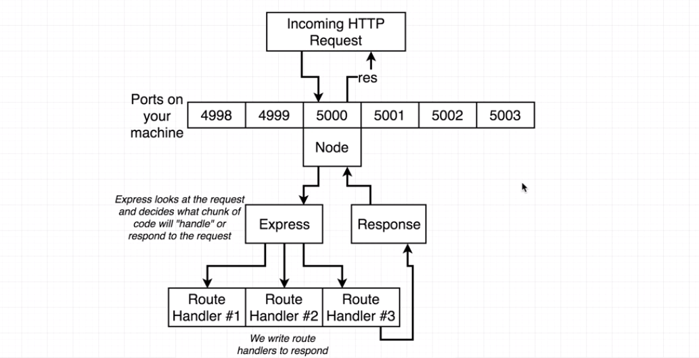
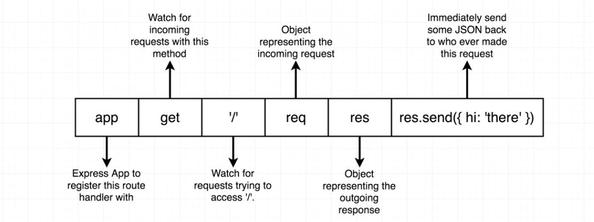
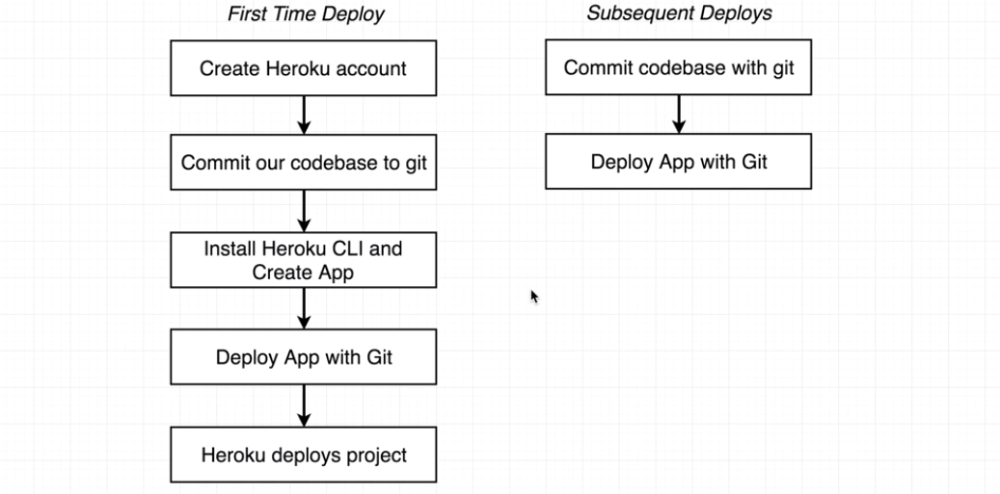

# Server Side Architecture

### Contents

1. [Relationship Between Node & Express](#user-content-1-relationship-between-node--express)
2. [Generating Our First Express App](#user-content-2-generating-our-first-express-app)
3. [Express Route Hanlders](#user-content-3-express-route-hanlders)
4. [How to Deploy the Application](#user-content-4-how-to-deploy-the-application)
    * [Deployment Checklist](#user-content-41-deployment-checklist)
    * [Actual Deployment Process](#user-content-42-first-time-deployment-process)
    * [Subsequent Deploys](#user-content-43-subsequent-deploys)

---

### 1. Relationship Between Node & Express

Update NPM to version 5 and install Express:
```
npm update -g
npm install --save express
```

* Node: JS runtime used to execute code outside of the browser.
* Express: A library that runs in the Node runtime. It has helpers to make dealing with HTTP traffic easier.



Node will take the information from the HTTP request and give it to the Express side of our application. Express will then figure out where to send that incoming request to. Some response will then be generated.

---

### 2. Generating Our First Express App

We will create our first Express route handler. First created a new file `'./index.js'`. This is the root file for Node.

Note that we use `'require'` instead of `'import'`, which is common JS module rather than ES2015 module. Because at present, the NodeJS runtime only has support for common JS modules. But we will use ES2015 modules in the client side for React.

```javascript
// ./index.js
//---------------------------------------------------------
// Import Express
const express = require('express');

// Create An Express Application
// We may have several Express applications in a project.
const app = express();

// Create A Route Handler
app.get('/', (req, res) => {
  res.send({ hi: 'there' });
});

// Listen to port 5000
app.listen(5000);
```

The use of an Express application is to set up configuration that will listen for incoming requests that will be routed to the Express side from the Node side, and then route these requests to different route handlers.

Run this project:
```
node index.js
```
We can view the page by entering `localhost:5000` in the browser.

---

### 3. Express Route Hanlders

We created our first route hanlder in the last section. Let's go through it piece by piece.



By calling `app.get()`, we are creating a brand new route handler. Express has access to several other methods as well:

* **get:** Get info from the server
* **post:** Send info to the server
* **put:** Update all the properties of something
* **delete:** Delete something
* **patch:** Update one or two properties of something

---

### 4. How to Deploy the Application

We'll use [Heroku](https://www.heroku.com/) to handle the deployment.

#### 4.1. Deployment Checklist

4.1.1. Dynamic Port Binding:

Heroku tells us which port our app will use, so we need to make sure we listen to the port they tell us to.

Whenever Heroku runs our application, it will inject the `env` variable. Modify our code to listen to a dynamic port:
```javascript
// ./index.js
//---------------------------------------------------------
// Before:
app.listen(5000);

// After:
// If there is not a variable named 'env', just use 5000.
const PORT = process.env.PORT || 5000;
app.listen(PORT);
```

4.1.2. Specify Node Environment:

We want to use a specific version of node, so we need to tell Heroku which version we want.

Add `"engines"` property in `'./package.json'`, remember to use double quotes.
```javascript
// ./package.json
//---------------------------------------------------------
"engines": {
  "node": "8.1.1",
  "npm": "5.0.3"
},
```

4.1.3. Specify Start Script:

Instruct Heroku what command to run to start our server running.

Modify `"scripts"` in `'./package.json'` and added a new script `"start"`:
```javascript
// ./package.json
//---------------------------------------------------------
"scripts": {
  "start": "node index.js"
},
```

4.1.4. Create `.gitignore` File

We don't want to include dependencies, Heroku will do that for us.
```javascript
// ./.gitignore
//---------------------------------------------------------
// It tells git not to commit everything inside 'node_modules'
node_modules
```

#### 4.2. First Time Deployment Process



By default, Heroku uses a git-based deployment procedure.

More information about Heroku CLI here:  [https://devcenter.heroku.com/articles/heroku-cli#macos](https://devcenter.heroku.com/articles/heroku-cli#macos). We can install Heroku CLI via [Homebrew](https://brew.sh/).
```
brew install heroku
heroku -v
```

Create a new Heroku app:
```
heroku login
heroku create

# Output: https://vast-garden-42186.herokuapp.com/ | https://git.heroku.com/vast-garden-42186.git
```

The first link above is the url of our app. The second link is our deployment target. It is a git repository that we can push our local server to.

Add a remove repository to our current repository and we want to name that repository `heroku`:
```
git remote add heroku https://git.heroku.com/vast-garden-42186.git
```

We can then run the command to deploy our application:
```
git push heroku master
```

If we go to url [https://vast-garden-42186.herokuapp.com/](https://vast-garden-42186.herokuapp.com/) now, we can view our application online. We can also run `heroku open` to automatically open a browser and go to our application url. If you ran into some error, run `heroku logs` for trouble shooting.

#### 4.3. Subsequent Deploys

After we made some changes, we need to use `git add .` and `git commit -m "some message"` to commit the changes. Then run the following code to push the chagnes to Heroku server:
```
git push heroku master
```
