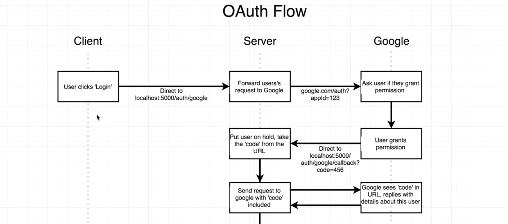
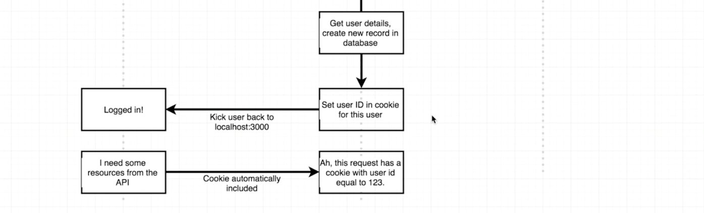
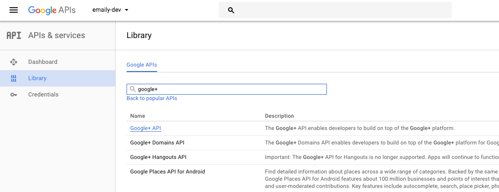
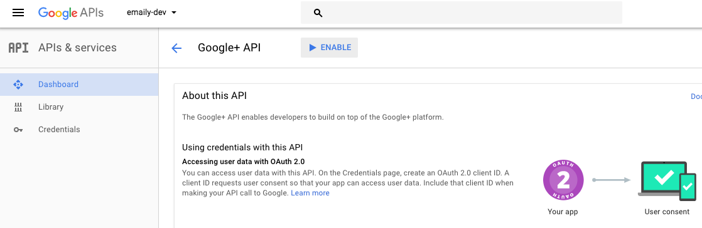
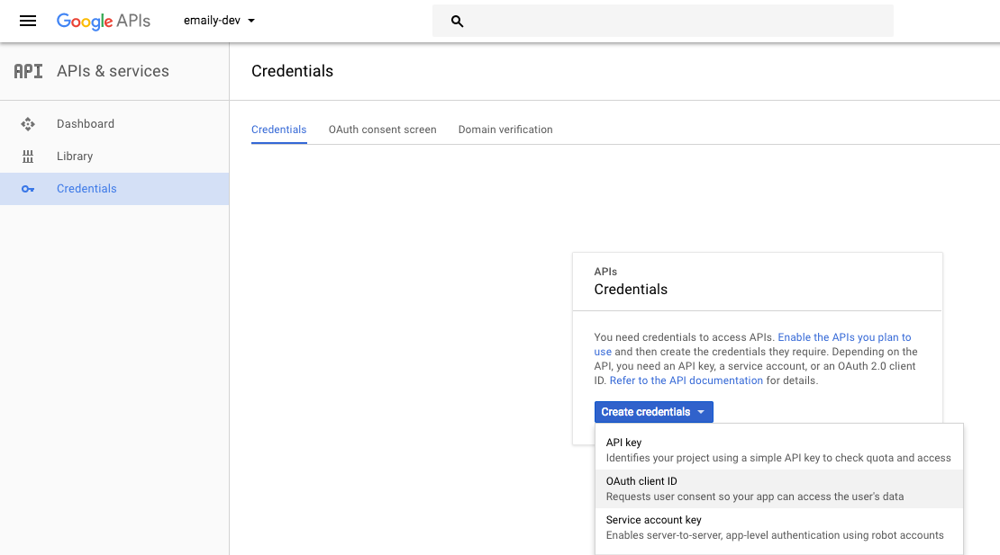
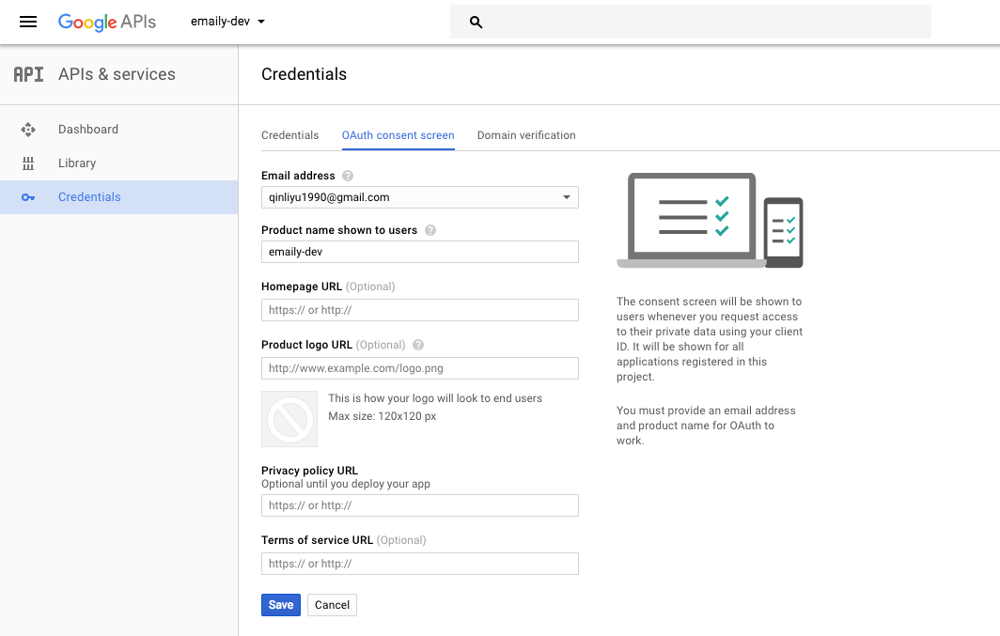
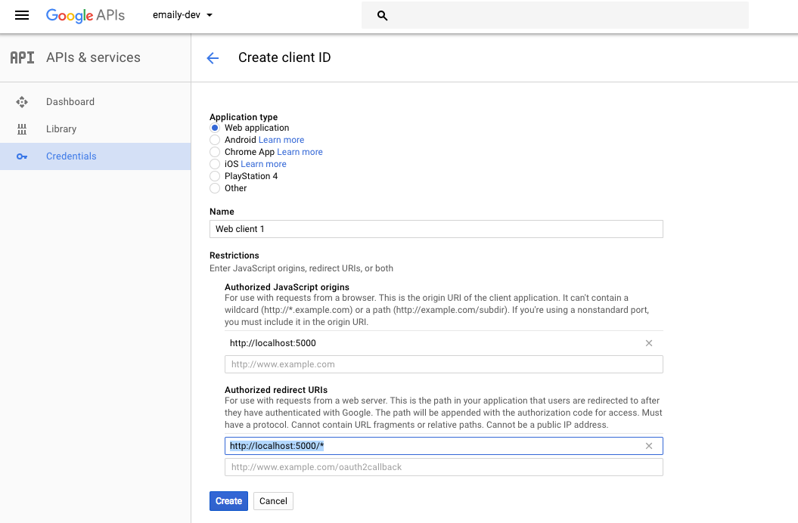
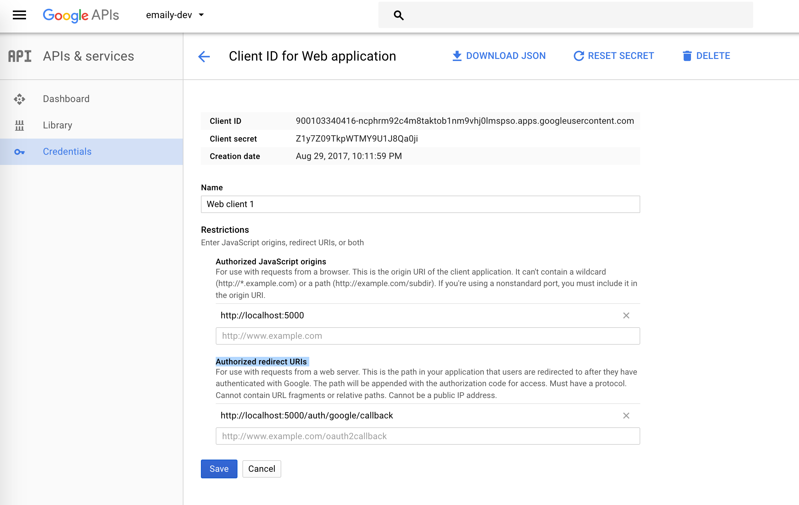

# Authentication with Google OAuth

### Contents

1. [Intro to Google OAuth](#user-content-1-google-oauth-flow)
2. [Passport JS](#user-content-2-passport-js)
    * [What is Passport](#user-content-21-what-is-passport)
    * [Passport Setup](#user-content-22-passport-setup)
    * [Enabling Google OAuth API](#user-content-23-enabling-google-oauth-api)
    * [Securing API Keys](#user-content-24-securing-api-keys)
3. [Testing OAuth](#user-content-3-testing-oauth)
4. [Access and Refresh Tokens](#user-content-4-access-and-refresh-tokens)
5. [Nodemon Setup](#user-content-5-nodemon-setup)
6. [Appendix](#user-content-6-appendix)

---

### 1. Google OAuth Flow

We want to have a button 'Sign in with Google'.




When users click the login button, they will be redirected to a route like `'localhost:5000/auto/google'`. We then send the request to Google. Google will then ask the user if they grant permission.

If the user grants the permission, we can get a code from the callback url. We can send request to Google with this code and ask for some user information. The create a new record in our database with the user info.

---

### 2. Passport JS

#### 2.1. What is Passport

We're going to approach the OAuth problem with a library [Passport](http://passportjs.org/). We can use it to create the authentication flow.

Two libraries are needed to be installed:

* **passport:** General helpers for handling auth in Express apps.
* **passport strategy:** Helpers for authentication with one very specific method (email/pwd, Google, Facebook, etc).

#### 2.2. Passport Setup

Install several libraries (passport and a passport strategy named [passport-google-oauth20](https://github.com/jaredhanson/passport-google-oauth2)):
```
npm install --save passport passport-google-oauth20
```

Just put everything in './index.js' for now, and we will come back to refactor it in the future.

```javascript
// ./index.js
//---------------------------------------------------------
// Import Passport and a property from the strategy
const passport = require("passport");
const GoogleStrategy = require("passport-google-oauth20").Strategy;
// Use Passport
passport.use(new GoogleStrategy());
```

#### 2.3. Enabling Google OAuth API

We need to pass some options to `GoogleStrategy`. The app has to be signed up with Google OAuth API in [https://console.developers.google.com](https://console.developers.google.com). I created a new project named `emaily-dev`.


Then click the button `'ENABLE APIS'`. Search for 'google+' then click the `'ENABLE'` button:




Create credentials and create client ID:



Configure consent screen:




In the end, we got two strings:

* Client ID: 900103340416-ncphrm92c4m8taktob1nm9vhj0lmspso.apps.googleusercontent.com
* Client Secret: Z1y7Z09TkpWTMY9U1J8Qa0ji

#### 2.4. Securing API Keys

The client ID is a public token, we can share this with the public. However, the client secret is a private token. How can we secure our API keys so that we will not push it to GitHub?

We can create a new file `'./config/keys.js'` to store all sensitive keys.

```javascript
// ./config/keys.js
//---------------------------------------------------------
module.exports = {
  googleClientID: '900103340416-ncphrm92c4m8taktob1nm9vhj0lmspso.apps.googleusercontent.com',
  googleClientSecret: 'Z1y7Z09TkpWTMY9U1J8Qa0ji'
};
// ./.gitignore
//---------------------------------------------------------
node_modules
keys.js
```

Finally, we can import the keys and pass them into `GoogleStrategy()`:
```javascript
// ./index.js
//---------------------------------------------------------
const keys = require('./config/keys');

passport.use(
  new GoogleStrategy(
    {
      clientID: keys.googleClientID,
      clientSecret: keys.googleClientSecret,
      callbackURL: "/auth/google/callback"
    },
    accessToken => {
      console.log(accessToken);
    }
  )
);
```

---

### 3. Testing OAuth

First, we need to create a route handler to make sure that the user get kicked into the Passport flow.

```javascript
// ./index.js
//---------------------------------------------------------
app.get(
  "/auth/google",
  passport.authenticate('google', {
    scope: ['profile', 'email'] // What access we want to have
  })
);
```
If we try to enter `'http://localhost:5000/auth/google'` in our browser, we'll get an error: `redirect_uri_mismatch`. The url for this error is:
```
https://accounts.google.com/o/oauth2/v2/auth?response_type=code&redirect_uri=http%3A%2F%2Flocalhost%3A5000%2Fauth%2Fgoogle%2Fcallback&scope=profile%20email&client_id=900103340416-ncphrm92c4m8taktob1nm9vhj0lmspso.apps.googleusercontent.com
```

We can see from the url that the user should be redirected to `http://localhost:5000/auth/google/callback`. So we need to update our 'Authorized redirect URIs':



Now if we enter the url `http://localhost:5000/auth/google`, we can see the page to grant permission.

A handler for callback uri is needed:
```javascript
// ./index.js
//---------------------------------------------------------
app.get(
  "/auth/google/callback",
  passport.authenticate('google')
);
```

---

### 4. Access and Refresh Tokens

After the user grants the permission, the second parameter when initializing `GoogleStrategy` will be executed. The parameter is `accessToken`.

```javascript
// ./index.js
//---------------------------------------------------------
passport.use(
  new GoogleStrategy(
    {
      clientID: keys.googleClientID,
      clientSecret: keys.googleClientSecret,
      callbackURL: "/auth/google/callback"
    },
    (accessToken, refreshToken, profile, done) => {
      console.log('access token', accessToken);
      console.log('refresh token', refreshToken);
      console.log('profile', profile);
    }
  )
);
```

If we run `npm start` this time, we can see some data in our terminal:

```javascript
access token ya29.Glu3BH61CPKSX1hcp6bFsIoKY3gIvbwpka9Cj6deqoVwaiYyg2jBJsR5lbqUUVwhtBG5_zILiLdVXHfGYudGGhWtmPEs8p_XCKz13Yv6R2KTjiS8TUwmu66HYLJt
refresh token undefined
profile { id: '101194515811903038601',
  displayName: 'Liyu Qin',
  name: { familyName: 'Qin', givenName: 'Liyu' },
  emails: [ { value: 'qinliyu1990@gmail.com', type: 'account' } ],
  photos: [ { value: 'https://lh5.googleusercontent.com/-9lr1Fh-bgK8/AAAAAAAAAAI/AAAAAAAAAR4/vE7A2w5BwH4/photo.jpg?sz=50' } ],
  gender: 'male',
  ...
}
```

---

### 5. Nodemon Setup

Whenever `'./index.js'` was changed, we need to kill our server and restart it by entering `'npm start'`. We can use `nodemon` to refresh the page immediately.

```
npm install --save nodemon
```

Create a new script in our `'./package.json'`:
```javascript
// ./package.json
//---------------------------------------------------------
"scripts": {
  "start": "node index.js",
  "dev": "nodemon index.js"
},
```

We can then start the server and make any modification. Webpages will be updated automatically.

```
npm run dev
```

---

### 6. Appendix

To sum up, here is the complete code of `'./index.js'` so far:

```javascript
// ./index.js
//---------------------------------------------------------
const express = require("express");
const passport = require("passport");
const GoogleStrategy = require("passport-google-oauth20").Strategy;
const keys = require("./config/keys");

const app = express();

//-------------------------------------------------------------------
// Use Passport
//-------------------------------------------------------------------
passport.use(
  new GoogleStrategy(
    {
      clientID: keys.googleClientID,
      clientSecret: keys.googleClientSecret,
      callbackURL: "/auth/google/callback"
    },
    (accessToken, refreshToken, profile, done) => {
      console.log('access token', accessToken);
      console.log('refresh token', refreshToken);
      console.log('profile', profile);
    }
  )
);

//-------------------------------------------------------------------
// Route Handler
//-------------------------------------------------------------------
// Homepage
app.get(
  "/",
  (req, res) => {
    res.send({ hi: 'there' });
  }
);
// Google OAuth
app.get(
  "/auth/google",
  passport.authenticate('google', {
    scope: ['profile', 'email']
  })
);
// Callback
app.get(
  "/auth/google/callback",
  passport.authenticate('google')
);

//-------------------------------------------------------------------
// Listen to Port
//-------------------------------------------------------------------
const PORT = process.env.PORT || 5000;
app.listen(PORT);
```
