# Adding MongoDB

### Contents

1. [Server Structure Refactor](#user-content-1-server-structure-refactor)
2. [Sign In Users with OAuth](#user-content-2-sign-in-users-with-oauth)
    * [Theory of Authentication](#user-content-21-theory-of-authentication)
    * [High-level Overview of the Process](#user-content-22-high-level-overview-of-the-process)
3. [MongoDB Setup](#user-content-3-mongodb-setup)
    * [Introduction to MongoDB](#31-introduction-to-mongodb)
    * [Setup MongoDB and Wire It Up with Express](#32-setup-mongodb-and-wire-it-up-with-express)
    * [Connecting Mongoose to MongoDB](#user-content-33-connecting-mongoose-to-mongodb)
4. [Working with Mongoose](#user-content-4-working-with-mongoose)
    * [Mongoose Model Classes](#user-content-41-mongoose-model-classes)
    * [Saving Model Instances](#user-content-42-saving-model-instances)
    * [Mongoose Queries](#user-content-43-mongoose-queries)
5. [Finishing up with Authentication](#user-content-5-finishing-up-with-authentication)
    * [Encoding Users](#user-content-51-encoding-users)
    * [Enabling Cookies](#user-content-52-enabling-cookies)
    * [Testing Authentication](#user-content-53-testing-authentication)


---

### 1. Server Structure Refactor

Putting everything in `./index.js` is not a good idea. We can create 3 different folders and a file:

* **config:** Protected API keys and settings.
* **routes:** All route handlers, grouped by purpose.
* **services:** Helper modules and business logic.
* **index.js:** Helper modules and business logic.

Move something out from `./index.js`:

```javascript
// ./routes/authRoutes.js
//---------------------------------------------------------
// This is the initial passport module.
// Not the one created in './services/passport.js'.
const passport = require("passport");

module.exports = (app) => {
  // Google OAuth
  app.get(
    "/auth/google",
    passport.authenticate('google', {
      scope: ['profile', 'email']
    })
  );
  // Callback
  app.get(
    "/auth/google/callback",
    passport.authenticate('google')
  );
}

// ./services/passport.js
//---------------------------------------------------------
const passport = require("passport");
const GoogleStrategy = require("passport-google-oauth20").Strategy;
const keys = require("../config/keys");

passport.use(
  new GoogleStrategy(
    {
      clientID: keys.googleClientID,
      clientSecret: keys.googleClientSecret,
      callbackURL: "/auth/google/callback"
    },
    (accessToken, refreshToken, profile, done) => {
      console.log('access token', accessToken);
      console.log('refresh token', refreshToken);
      console.log('profile', profile);
    }
  )
);
```

We also need to import everything from `./routes/` and `./services/` to our homepage:
```javascript
// ./index.js
//---------------------------------------------------------
require("./services/passport");
// This is a function that takes our 'app' and attach two routes to it.
const authRoutes = require("./routes/authRoutes");
const app = express();
authRoutes(app);
```


Actually, we can ignore the variable `authRoutes` and simplify `./index.js`:
```javascript
// ./index.js
//---------------------------------------------------------
// Before:
const authRoutes = require("./routes/authRoutes");
const app = express();
authRoutes(app);
// After:
const app = express();
require("./routes/authRoutes")(app);
```

---

### 2. Sign In Users with OAuth

#### 2.1. Theory of Authentication

After getting the accessToken from Google, let's figure out what it really means to authenticate the user.

We communicate between our browser and our Express by HTTP request. By default, information btw requests are not shared. The token is the proof that we are the right person who made the original request. We are going to use cookie-based authentication.

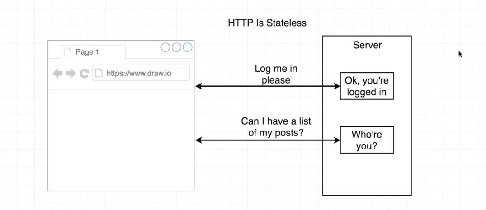

When we made the initial request, the response will have a header `'Set-Cookie'`, with the value which can uniquely identify the user. The browser will then store it in the browser's memory. The cookie will be automatically appended to any following request to the server.

#### 2.2. High-level Overview of the Process

The user will sign up first and sign out. He will sign in sometime in the future with the same email and password.

Remember we can get his Google profile when he signed up or signed in. We need to find some unique identifying token in the user's Google profile. Is that consistent between logins? Use that to decide if the user is the same. `id` from Google's profile is a good pick. That is the unique ID for this particular user, which will never change over time.

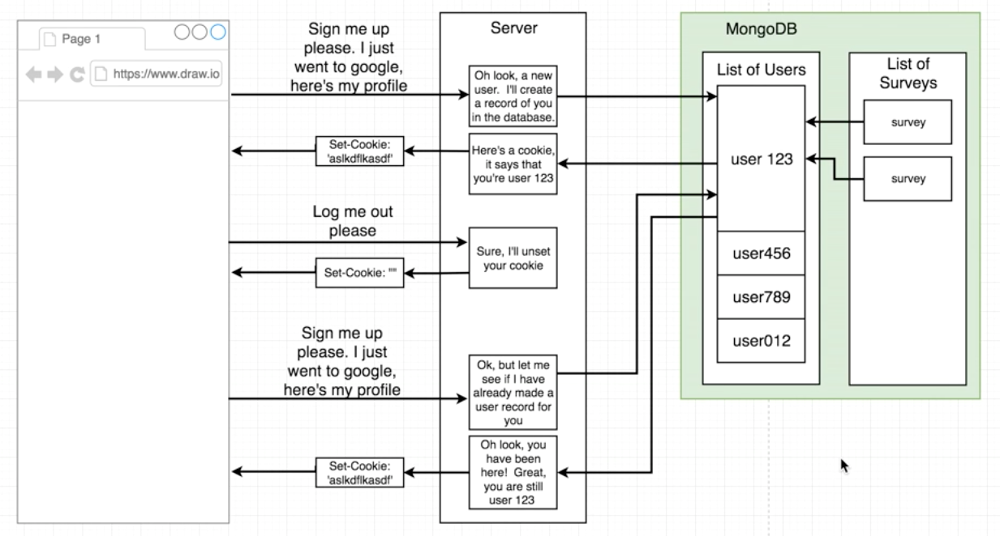

The whole OAuth purpose is to give us the Google ID, we just care about the ID. The critical part for identifying the user is the MongoDB. We'll set it up later.

---

### 3. MongoDB Setup

#### 3.1. Introduction to MongoDB

Our Express server will communicate with MongoDB to save or pull out records. We will use a library called `mongoose.js`. It wrapped up a lot of operations and will make our lives easier.

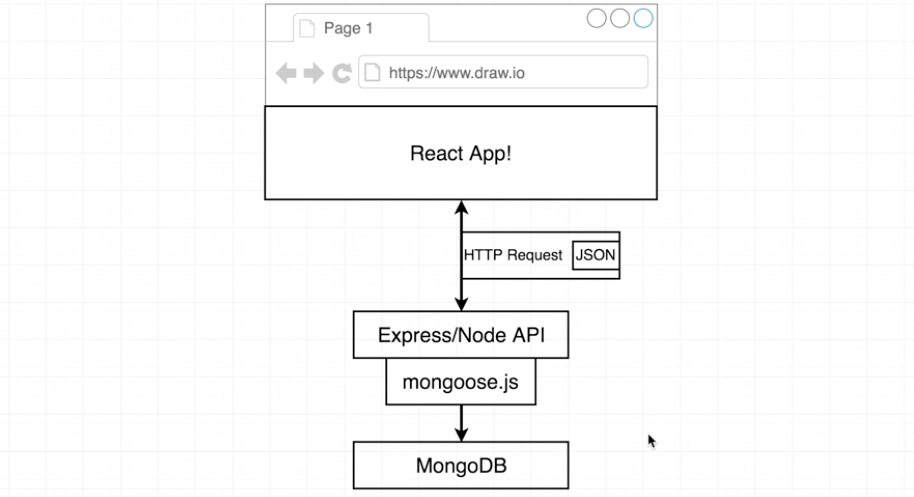

MongoDB internally stores records into different collections. Every single record is a JSON object. One of the important defining characteristics of MongoDB is `schemaless`. Every record can have its own distinct properties.

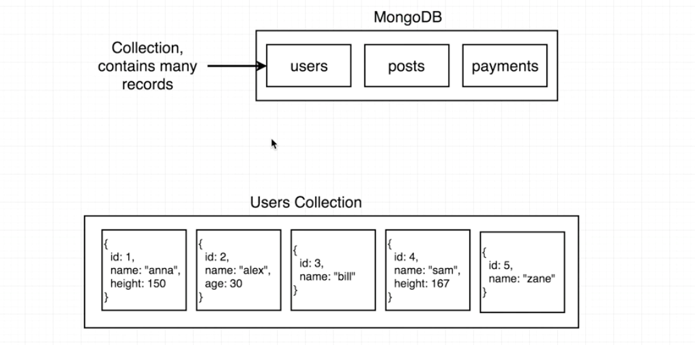

What Mongoose will do for us? MongoDB has its own structure as we described above. To represent the type of structure in the JavaScript world, we have two important concepts implemented by Mongoose.

* Model Class: a model class represents an entire MongoDB collection.
* Model Instance: a JavaScript object that represents a single record sitting inside a collection.

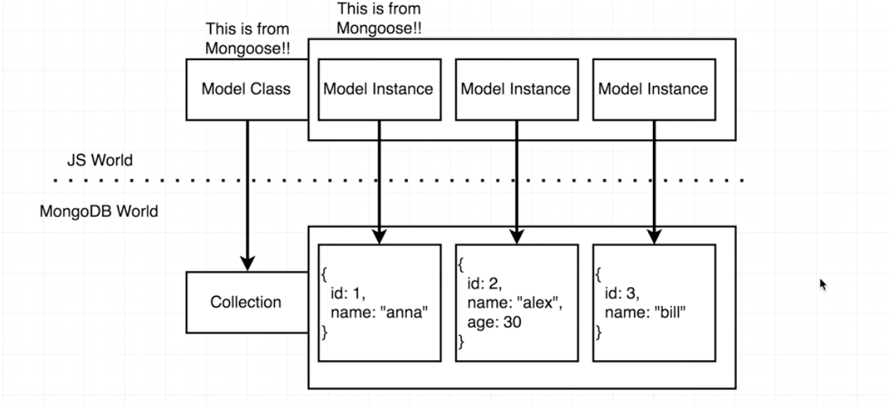

#### 3.2. Setup MongoDB and Wire It Up with Express

We can remotely hosted MongoDB using a third-party service called [mlab](https://mlab.com/), which is much easier. Just create an account and create a new deployment with AWS as the cloud provider

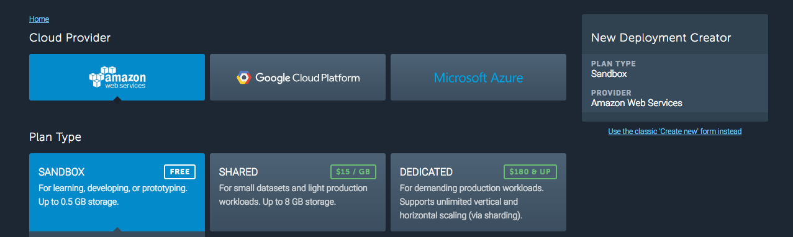

After creating a new database, we need a new database user (not an application user). Go to database console and open `User` tab to create one.

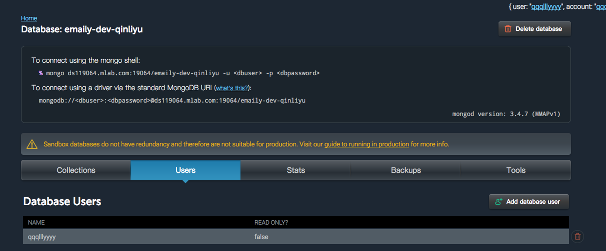

#### 3.3. Connecting Mongoose to MongoDB

Install Mongoose locally:
```
npm install --save mongoose
```
Import mongoose it to `./index.js` and connect it to the MongoDB we just created:
```javascript
// ./index.js
//---------------------------------------------------------
const mongoose = require('mongoose');
const keys = require('./config/keys');
// Pass the address in, the address is in mlab console. Save it to ./config/keys.js for security.
mongoose.connect(keys.mongoURI);
```
Now we installed MongoDB and Mongoose. What to do next:

* Need to be able to identify users who sign up and return to our application. We want to save the 'id' in their google profile.
* Use Mongoose to create a new collection in Mongo called `'users'`.
* When user signs in, save new record to the `'users'` collection.

---

### 4. Working with Mongoose

#### 4.1. Mongoose Model Classes

Let's create a model class using Mongoose, which will allow us to create a new collection in MongoDB. We want to find a suitable location to do that: `./models/`. This directory will contain all the models that we created using Mongoose.
```javascript
// ./models/User.js
//---------------------------------------------------------
const mongoose = require('mongoose');
const { Schema } = mongoose; // ES2015 version of: const Schema = mongoose.Schema;
// Define a schema, what records will look like
const userSchema = new Schema({
  googleId: String // Define the type, 'Number' is another option.
});
// First parameter is the name of the collection.
mongoose.model('users', userSchema);
```

Then import it in `./index.js`:
```javascript
// ./index.js
//---------------------------------------------------------
require("./models/User");
```

#### 4.2. Saving Model Instances

Remember we have a callback function after OAuth procedure in `'./services/passport.js'` and a parameter `'profile'` which contains a Google ID.
```javascript
// ./services/passport.js
//---------------------------------------------------------
// Make sure we get access to the database
const mongoose = require('mongoose');
// Get access to the database collection 'user'.
const User = mongoose.model("users");
```

We also used the function `mongoose.model("users", userSchema);` in `'./models/User.js'`. If we pass in two parameters, we will create a collection with a schema. If we use only one parameter, we will pull the model out of Mongoose.

After we have the model class `User`, we can create a new model instance using that model class, and save it to the database.
```javascript
// ./services/passport.js
//---------------------------------------------------------
passport.use(
  new GoogleStrategy(
    {
      clientID: keys.googleClientID,
      clientSecret: keys.googleClientSecret,
      callbackURL: "/auth/google/callback"
    },
    (accessToken, refreshToken, profile, done) => {
      // Creates a new instance of the user.
      // Not saved to database yet if we forget '.save()'
      new User({ googleId: profile.id }).save();
    }
  )
);
```

Test with our database: run `npm run dev` and go to [http://localhost:5000/auth/google](http://localhost:5000/auth/google). A record will be created in our database in mlab console:

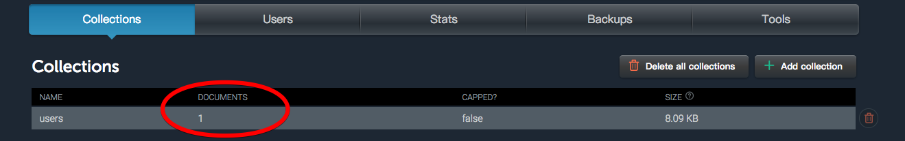

#### 4.3. Mongoose Queries

If we signed up twice, we will have two records with the same Google ID. We need to update the code to skip user creation if the ID already exists.

Mongoose queries will return promises, we need `.then()` to resolve it.
```javascript
// ./services/passport.js
//---------------------------------------------------------
passport.use(
  new GoogleStrategy(
    {
      clientID: keys.googleClientID,
      clientSecret: keys.googleClientSecret,
      callbackURL: "/auth/google/callback"
    },
    (accessToken, refreshToken, profile, done) => {
      // Try to find a user with current id. Return a promise
      User.findOne({ googleId: profile.id }).then(existingUser => {
        if (existingUser) {
          // We already have a record with the given id.
        } else {
          // We want to create a new user.
          // Not saved to database yet if we forget '.save()'
          new User({ googleId: profile.id }).save();
        }
      });
    }
  )
);
```

After creating a user record or skipping user creation, we need to call a function `done()` to tell `passport` that we have finished creating a user and that it should now resume the auth process. The first argument for `done()` is an error object. The second argument is the user record.

```javascript
// ./services/passport.js
//---------------------------------------------------------
passport.use(
  new GoogleStrategy(
    {
      clientID: keys.googleClientID,
      clientSecret: keys.googleClientSecret,
      callbackURL: "/auth/google/callback"
    },
    (accessToken, refreshToken, profile, done) => {
      // Try to find a user with current id. Return a promise
      User.findOne({ googleId: profile.id }).then(existingUser => {
        if (existingUser) {
          // The first argument is an error object. The second argument is the user record.
          done(null, existingUser);
        } else {
          // `save()` is an async call.
          new User({ googleId: profile.id })
            .save()
            .then(user => done(null, user)); // 'user' is the user just saved.
        }
      });
    }
  )
);
```

---

### 5. Finishing up with Authentication

#### 5.1. Encoding Users

We're almost done with the authentication process, but still need to get cookies done.

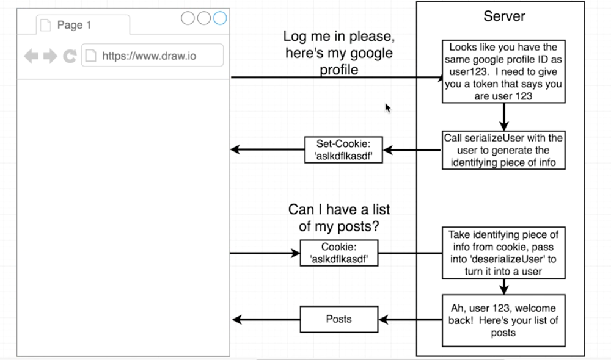

To generate token, which is the identifying information, we define a function `serializeUser()`. The function will be called by `User` model.

When the user wants to make another request, the cookie will be automatically added in the request by the browser. `passport` will take that cookie and pass it in another function named `deserializeUser()` defined by us, in which we'll take that identifying information and turn it back into a `User` model.

```javascript
// ./services/passport.js
//---------------------------------------------------------
// Before this step, we just fetched a user model from database or created a new one.
passport.serializeUser((user, done) => { // First argument is a `User` model
  /**
   * @param error object
   * @param info to identify the user
   */
  // 'user.id' here is not the profile id from Google. It is the '_id' from the MongoDB record.
  // The reason not to use Google id is that we may implement Facebook OAuth in the future.
  done(null, user.id);
});
passport.deserializeUser((id, done) => {
  // Search for a record
  User.findById(id)
    .then(user => {
      done(null, user);
    });
});
```

OAuth's only purpose is to allow someone to sign in. After that, we use our own internal ID's:

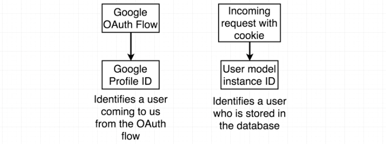

#### 5.2. Enabling Cookies

Now we have `serializeUser()` and `deserializeUser()`. Lastly, we need to tell `passport` to handle the authentication process with cookies.

Install a new library `cookie-session` to manage cookies in our application:
```
npm install --save cookie-session
```
Import related libraries in `./index.js`. Remember to add these code before adding routes to `app`: `authRoutes(app);`.
```javascript
// ./index.js
//---------------------------------------------------------
const cookieSession = require("cookie-session");
const passport = require("passport");
// Enable Cookie-based Authentication
app.use(
  /**
   * @param how long the cookie can exist in the browser
   * @param keys to encrypt our cookie, define it in './config/keys.js'
   */
  cookieSession({
    maxAge: 30 * 24 * 60 * 60 * 1000, // 30 days, unit is ms
    keys: [keys.cookieKey], // this must be an array
  })
);
// Tell Passport to Make Use of Cookie
app.use(passport.initialize());
app.use(passport.session());
```

#### 5.3. Testing Authentication

Here is the flow that will occur any time a user makes a request:

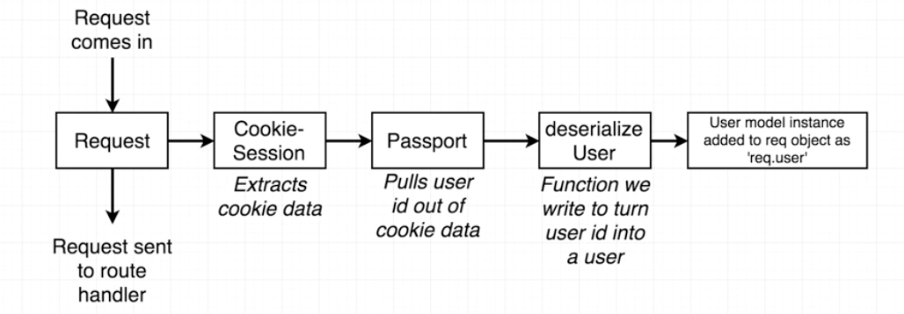

We can make another route handler to test the authentication result. Remember that the user model will be appended to `req` as `req.user`.

If we sign in again and go to [http://localhost:5000/api/current_user](http://localhost:5000/api/current_user), we can see the user model appeared in our browser:
```
{
  "_id": "59a899d98755cc2c5ee11a2f",
  "googleId": "101194515811903038601",
  "__v": 0
}
```
