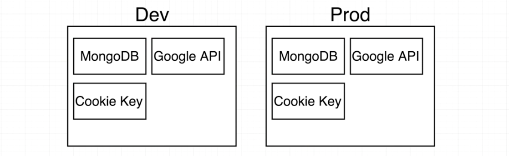
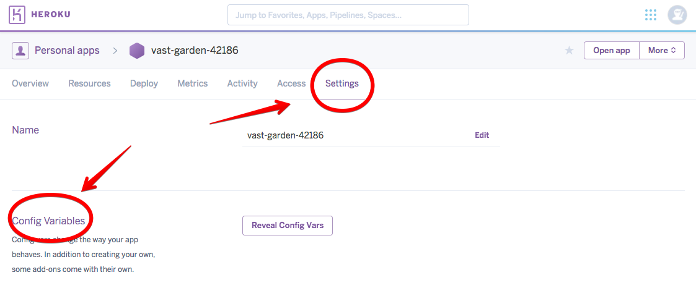
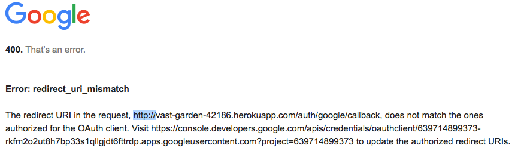
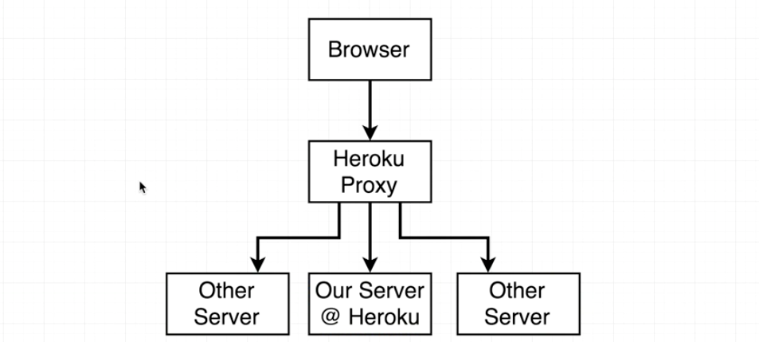

# Dev vs Prod Environments

### Contents

1. [Dev vs Prod Keys](#user-content-1-dev-vs-prod-keys)
2. [Determining Environment](#user-content-2-determining-environment)
3. [Heroku Env Variables](#user-content-3-heroku-env-variables)
4. [Fixing Heroku Proxy Issues](#user-content-4-fixing-heroku-proxy-issues)


---

### 1. Dev vs Prod Keys

We now store all secret keys in `./config/keys.js`. It's better to have two sets of keys for both development purpose and production website.

That way we can have two separate MongoDBs. We want to have a clean database in production.



Every time we want to use the keys, ask a question first: Are we doing dev or prod?

* prod: use env variables
* dev: use `./config/dev.js` (don't commit this)

As shown in the image, we need to generate production resources:

* Create a new database in [mlab](https://mlab.com/) with a user.
* Create a new Google API in [Google APIs](https://console.developers.google.com).

---

### 2. Determining Environment

Create two new files for development and production: `./config/dev.js` & `./config/prod.js`
```javascript
// ./config/dev.js
//---------------------------------------------------------
// dev.js - don't commit this
module.exports = {
  googleClientID: "xxxxxxxx",
  googleClientSecret: "xxxxxxxx",
  mongoURI: "xxxxxxxx",
  cookieKey: "xxxxxxxx"
};
// ./config/prod.js
//---------------------------------------------------------
// prod.js - production keys here.
module.exports = {
  googleClientID: process.env.GOOGLE_CLIENT_ID,
  googleClientSecret: process.env.GOOGLE_CLIENT_SECRET,
  mongoURI: process.env.MONGO_URI,
  cookieKey: process.env.COOKIE_KEY
};
```

We also need to modify `./config/keys.js` to figure out what set of credentials to return:
```javascript
// ./config/keys.js
//---------------------------------------------------------
// Determine whether we are in production env
// This is injected by Heroku
if (process.env.NODE_ENV === 'production') {
  // We are in production
  module.exports = require("./prod");
} else {
  // We are in dev env
  module.exports = require("./dev");
}
```

We do need to commit `./config/prod.js`.
```javascript
// ./.gitignore
//---------------------------------------------------------
node_modules
config/dev.js
.DS_Store
```

---

### 3. Heroku Env Variables

We need to define the environment variables in [Heroku](https://www.heroku.com/):



More information about environment variables can be found here: [https://devcenter.heroku.com/articles/config-vars](https://devcenter.heroku.com/articles/config-vars)


After those steps, we can deploy our new application.

```
git push heroku master
```

---

### 4. Fixing Heroku Proxy Issues

If we go to the production url [https://vast-garden-42186.herokuapp.com/auth/google](https://vast-garden-42186.herokuapp.com/auth/google), an error will occur:



It's weird since we registered our call-back uri with `https` in Google APIs. We have two reasons for this.

One reason is that we used a relative path in `./services/passport.js`:
```javascript
passport.use(
  new GoogleStrategy(
    {
      clientID: keys.googleClientID,
      clientSecret: keys.googleClientSecret,
      callbackURL: "/auth/google/callback"
    },
    ...
  )
);
```

Another reason is that by default, the strategy assumes that if our request from the browser ever went through any type of proxy, then the request should no longer be `https`. Because it doesn't want to trust a request that comes through a proxy. So we want to tell Goole that we want to trust any proxy btw browser and the server.



If we want to use the full url for `callbackURL`, we may want to change it every time when switching between dev and prod environment. We can just add another parameter `proxy` to trust the proxy:
```javascript
// ./services/passport.js
//---------------------------------------------------------
passport.use(
  new GoogleStrategy(
    {
      clientID: keys.googleClientID,
      clientSecret: keys.googleClientSecret,
      callbackURL: "/auth/google/callback",
      proxy: true
    },
    ...
  )
);
```
