# Moving to the Client Side

### Contents

1. [React App Generation](#user-content-1-react-app-generation)
2. [Running the Client and Server](#user-content-2-running-the-client-and-server)
3. [Routing Stumbling Block](#user-content-3-routing-stumbling-block)
4. [Why This Architecture (Optional)](#user-content-4-why-this-architecture-optional)
    * [Can We Separate the Client & Express Server](#user-content-41-can-we-separate-the-client--express-server)
    * [How Proxy Really Works](#user-content-42-how-proxy-really-works)


---

### 1. React App Generation

We are going to move to the client side with React. Note that setting up the client side is easy but understanding how it works with Express is complicated.

[create-react-app](https://github.com/facebookincubator/create-react-app) is a prefect module to generate a React app. Be sure to check out the documentation in the link provided, it's super easy to modify the project (e.g. adding SASS).

```
sudo npm install -g create-react-app
```

Use it to generate a new app:
```
create-react-app client
```

We now have a new folder `./client/`. The front-end app has its own built-in server. We can go into the `./client/` directory and run `npm start` to start the React application. We can go to `http://localhost:3000` to view the application:


Why does the React application have its own server? Here is a diagram showing how things are structured:

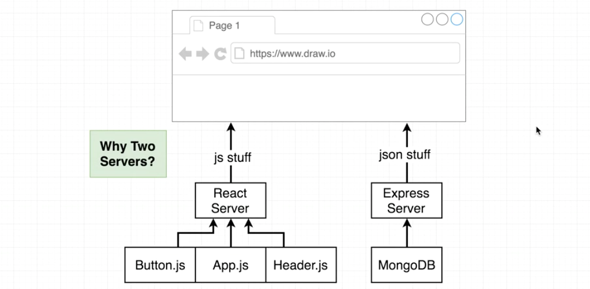

We setup the Express server before. It serves data and generates JSON response for requests from the browser. The React server will bundle different files and generate a file `bundle.js` using [Webpack](https://webpack.js.org/) and [Babel](https://babeljs.io/), then load it to the browser.

* **React server:** Serving up the front-end app assets.
* **Express server:** Serving up all the data.

---

### 2. Running the Client and Server

In this section we'll figure out how to run both the server and the client together in an elegant fashion. A package named `ddd` can help us run both the client and the server simultaneously.
```
npm install --save concurrently
```

Add two extra scripts in the `./package.json` for the server.
```javascript
// ./package.json
//---------------------------------------------------------
"scripts": {
  "start": "node index.js",
  "server": "nodemon index.js", // Changed the key from 'dev' to 'server'
  "client": "npm run start --prefix client", // Run 'npm run start' in the 'client' directory
  "dev": "concurrently \"npm run server\" \"npm run client\"" // Start both the server and the client
},
```

We can then run `npm run dev` to start both the client and the server:

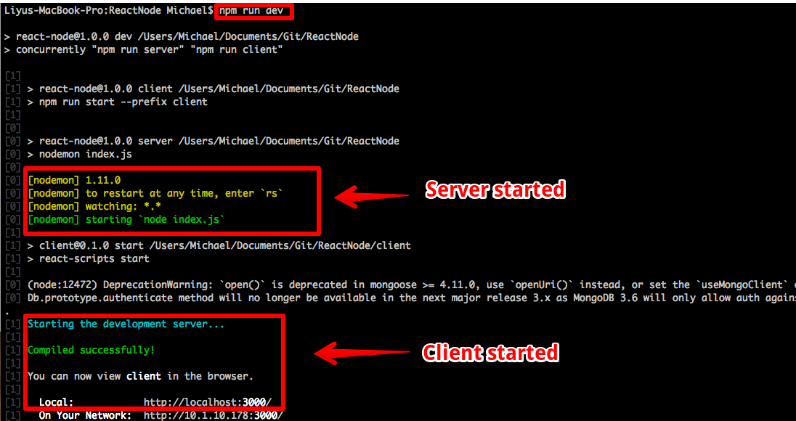

---

### 3. Routing Stumbling Block

We will add a small feature and then come across a stumbling block. After fixing it, we'll explain why it works.

The little feature is to add a button `'Sign in with Google'` in the client homepage [http://localhost:3000](http://localhost:3000).

It doesn't work if we add a link in `./client/src/App.js`: `<a href="/auth/google">Sing In With Google</a>`. We will not switch to `http://localhost:5000` from `http://localhost:3000`. So we can not use a relative link here. We don't want to enter the full url every time either.

To make the relative path work, we will add a new configuration in `./client/package.json`:

```javascript
// ./client/package.json
//---------------------------------------------------------
{
  "name": "client",
  ...
  "private": true,
  "proxy": {
    "/auth/google": {
      "target": "http://localhost:5000"
    }
  },
  ...
}
```
After setting up the proxy, we'll still get an error page if we click the button:

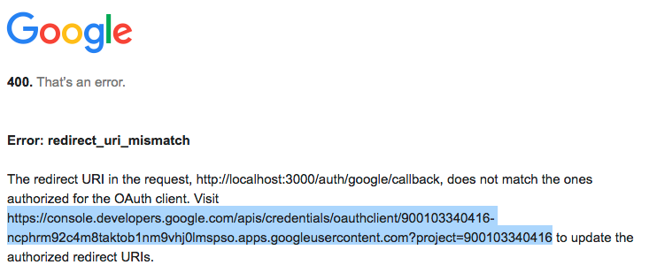

We need to go to the url provided in this error message and added a new `'Authorized redirect URI'` for our dev app:

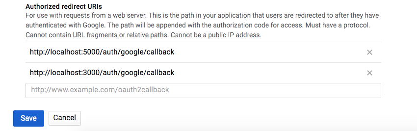

Now everything works fine. Let's discuss what's really going on here, and the beauty of creating React app's proxy.

We can imaging that there are two distinct layers in our application. When we need some data from API, the request is going to go to the `create-react-app` server, to a proxy that is automatically built-in and included with `create-react-app` server. That proxy will take that request and forward it on to Express API:

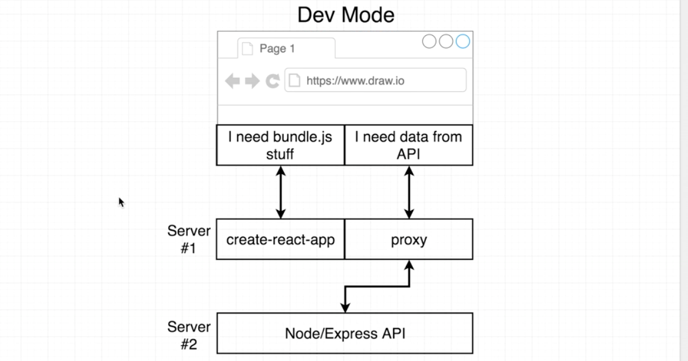

That is actually what we did with `./client/package.json` before.

However, we just want the proxy to work in the development mode, we don't want to go to `http://xxx.herokuapp.com:5000` when clicking the button. The proxy will automatically correct everything for us. It works perfectly between development and production.

The reason is that in production, the `create-react-app` server does not even exist.

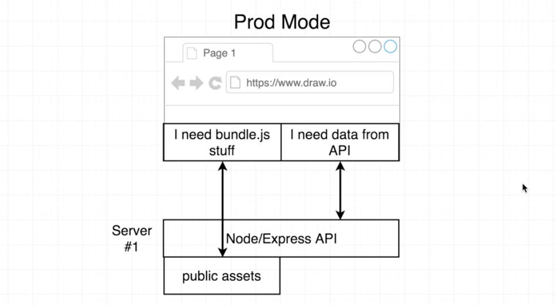

In production, before we deploy our app, we'll build our React project. `create-react-app` will take all the `js` and `css` files and run `webpack` & `babel` over all these files. It will generate a final production build of our application and save it into `./client/public/`.

Thus when a user comes our app, only Express API will run. We'll only send the client an HTML file, and the newly built javascript file in `./client/public/build`. We can easily test it:

```
cd client
npm run build
```

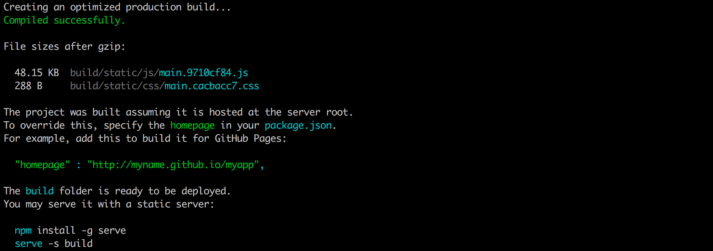

---

### 4. Why This Architecture (Optional)

In this section, we'll talk about why we made some decisions we just did.

#### 4.1. Can We Separate the Client & Express Server

Why don't we use the structure in the following image in our development environment? We can separate the backend API on a different domain.

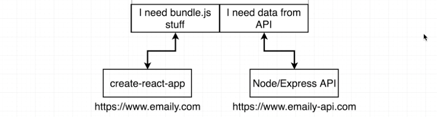

Because the one listed above may have some issues, which will make life harder:

The cookies is the only info used to authenticate the user. Cookies will only be included when making request to Express server because the browser is pointing to `http://localhost:3000`. This is a security issue. When making requests to a different domain, the browser assumes that it might have loaded some malicious js code that is attempting to make a request maliciously to some different domain. So it will not include the cookies.

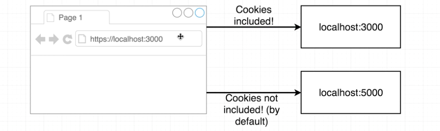

Our solution is better: Any API requests will always be pointed to the `create-react-app` server, and `create-react-app` will proxy that request onto the Express API. The browser doesn't know that the proxy is there. So we can get the cookies in Express server.

Another big issue is `CORS` request. When we are going to send a request to a different domain/port, that is called a `CORS` (cross origin resource sharing) request.

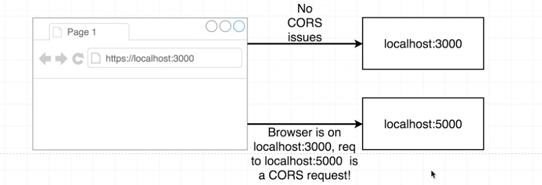

#### 4.2. How Proxy Really Works

To understand deeply how proxy is working with Express API, we'll walk through the dev mode and the production mode.

Here is a diagram for development flow:

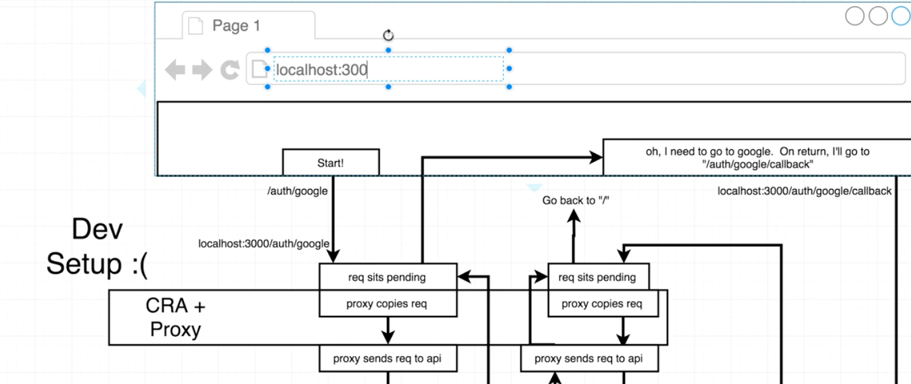

If we have a setting for '/auth/google', the proxy will copy the request and send it to the new route.

Here is the diagram for the production flow, it's much more simple:

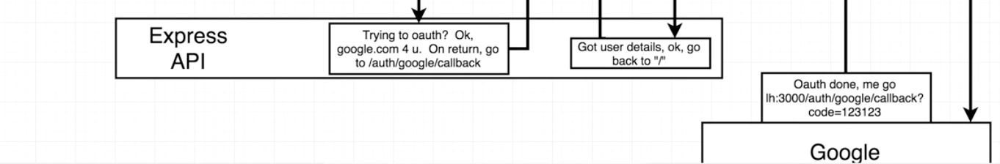
