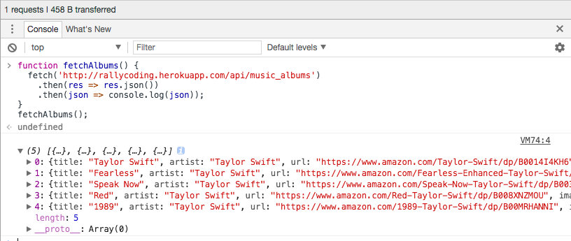
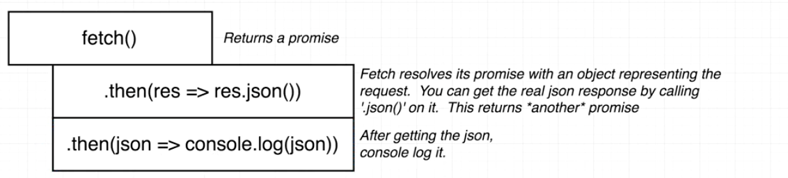
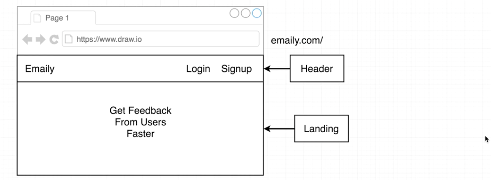
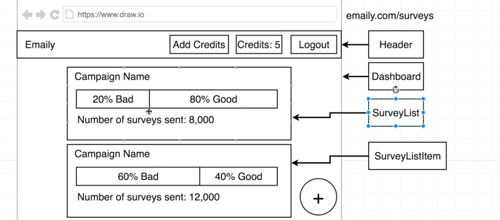
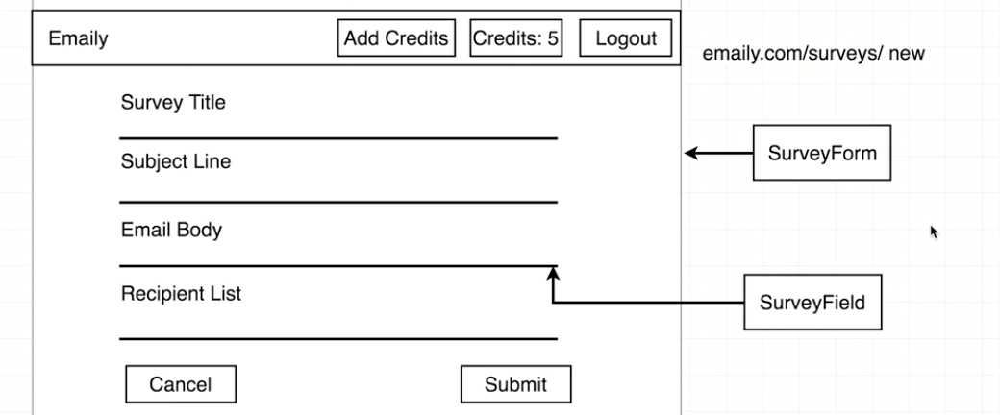
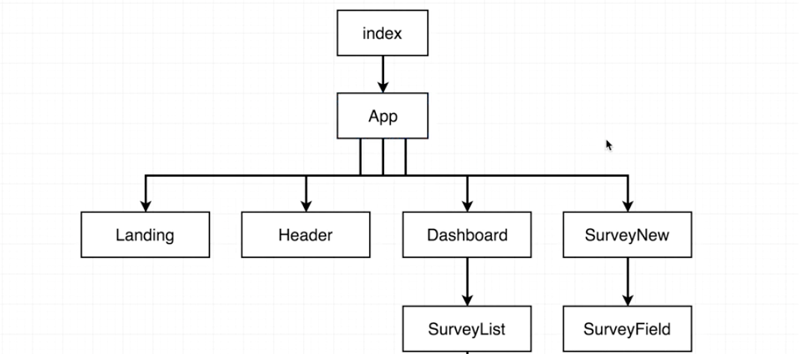
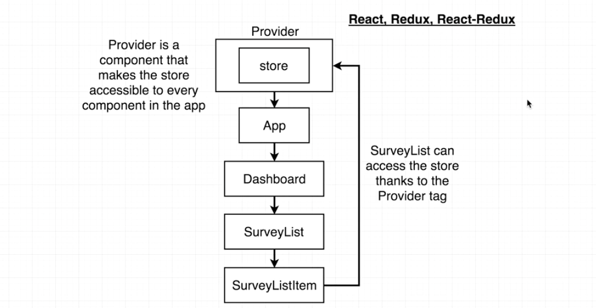
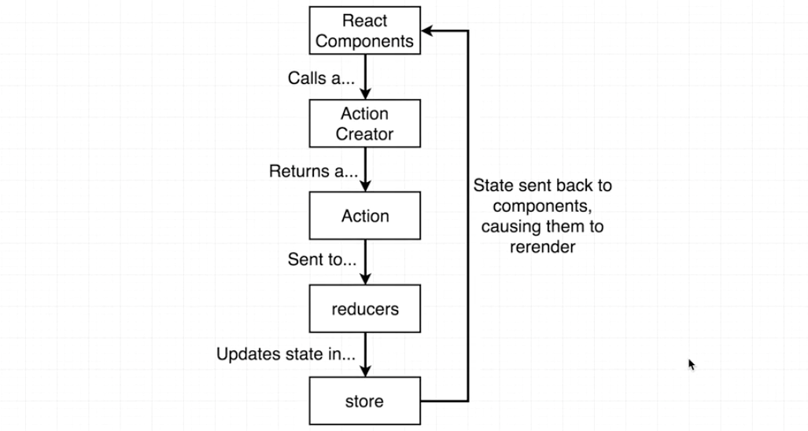
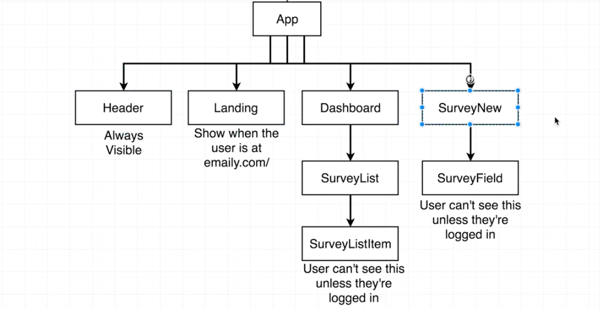

# Developing the Client Side - I

### Contents

1. [Async/Await Syntax](#user-content-1-asyncawait-syntax)
2. [Client Setup](#user-content-2-client-setup)
    * [Route Structures](#user-content-21-route-structures)
    * [React Setup](#user-content-22-react-setup)
    * [Redux Review](#user-content-23-redux-review)
    * [Redux Setup](#user-content-24-redux-setup)
    * [The Auth Reducer](#user-content-25-the-auth-reducer)
3. [Why We Care About Auth](#user-content-3-why-we-care-about-auth)

---

### 1. Async/Await Syntax

Before we developing the client side, let's talk about a little bit new JavaScript syntax in ES2017.

We used promises with our requests to the database in `'./services/passport.js'` to handle async request. We'll use some new syntax and refactor the code.

```javascript
// ./services/passport.js
//---------------------------------------------------------
passport.use(
  new GoogleStrategy(
    {...},
    (accessToken, refreshToken, profile, done) => {
      User.findOne({ googleId: profile.id }).then(existingUser => {
        if (existingUser) {
          done(null, existingUser);
        } else {
          new User({ googleId: profile.id })
            .save()
            .then(user => done(null, user));
        }
      });
    }
  )
);
```

We'll write some extra test code to understand the syntax. Use the API for testing: [http://rallycoding.herokuapp.com/api/music_albums](#http://rallycoding.herokuapp.com/api/music_albums).

Whenever we make a request with `'fetch()'`, it returns a promise.

```javascript
// Write a function to retrieve a blob of json
// make an ajax request! Use the 'fetch' function available in ES6.
function fetchAlbums() {
  fetch('http://rallycoding.herokuapp.com/api/music_albums')
    .then(res => res.json())
    .then(json => console.log(json));
}
fetchAlbums();
```

To test the function, just paste into a browser console:



The logic is as follows:



We can refactor is using new syntax in ES2017 to make life easier working with promises.

```javascript
// The keyword 'async' tells the JS that the function contains some async code.
// Add 'await' in front of each promise.
async function fetchAlbums() {
  const res = await fetch('http://rallycoding.herokuapp.com/api/music_albums');
  const json = await res.json();
  console.log(json);
}
fetchAlbums();
```

Now let's refactor our code dealing with the database. Note that `'async'` is support for node 7.6.0 or higher. We need to use `nvm` to update the node version first.

```javascript
// ./services/passport.js
//---------------------------------------------------------
passport.use(
  new GoogleStrategy(
    {...},
    async (accessToken, refreshToken, profile, done) => {
      const existingUser = await User.findOne({ googleId: profile.id });
      if (existingUser) {
        return done(null, existingUser);
      }
      const user = await User({ googleId: profile.id }).save();
      done(null, user);
    }
  )
);
```

---

### 2. Client Setup

#### 2.1. Route Structures

Here are basic structure for some scenes:





#### 2.2. React Setup

We don't want to use any boilerplate by `create-react-app`. So let's delete everything in `./client/src/` except for `'registerServiceWorker.js'`.

We'll have two root files:

* **./client/src/index.js:** Data layer control (all about `Redux`)
* **./client/src/App.js:** Rendering layer control (`React Router` related logic)



Install some dependencies (make sure we are in the `./client/` directory):
```
cd client
npm install --save redux react-redux react-router-dom
```

Create root files:

```javascript
// ./client/src/index.js
//---------------------------------------------------------
import React from 'react';
import ReactDOM from 'react-dom';
/**
 * @param Root component
 * @param Where we're going to render the component to inside our dom
 */
ReactDom.render();
```

Make a folder to store all the components in our application: `./client/src/components/` and create a new file `./client/src/components/App.js`.

If a given file is exporting a class or a component, we'll label it with a capital letter.

```javascript
// ./client/src/components/App.js
//---------------------------------------------------------
import React from 'react';
const App = () => {
  return (
    <div>
      <h3>Hi there!</h3>
    </div>
  );
};
export default App;
```

Then import the component `App` to `./client/src/index.js` and make sure we can display it on the screen. Note that everything will be displayed in a div with id root in `./client/public/index.html`.
```javascript
// ./client/src/index.js
//---------------------------------------------------------
import React from 'react';
import ReactDOM from 'react-dom';
import App from './components/App';
/**
 * @param Root component
 * @param Where we're going to render the component to inside our dom
 */
ReactDom.render(
  <App />,
  document.querySelector('#root')
);
```

We can then test the client side:

```
cd ..
npm run dev
```

#### 2.3. Redux Review

The `Redux` is all about holding all the state (data) in our application. The purpose of `React-Redux` is to make sure React and Redux work together properly. You can think the `Provider` tag as the glue btw React and Redux.



Here is how Redux works behind the screen:

1. At the very top we have a `redux store`, which is where all of our state exists.
2. To determine our current state or to change our state, we call an `action creator` which dispatches an action.
3. The action is sent to all the different `reducers`.
4. Those reducers are combined together with the `combineReducers` and that is used to update the state in our redux store.


Another diagram explaining the process can be viewed here:



No mater what kind of components structure we have, any component can have direct access to our state (data) by reaching redux store.

#### 2.4. Redux Setup

Now let's import something and set up Redux:
```javascript
// ./client/src/index.js
//---------------------------------------------------------
import { Provider } from 'react-redux';
import { createStore, applyMiddleware } from 'redux';
// Create a new instance of our redux store
/**
 * @param The different reducers
 * @param Initial state of our application
 * @param applyMiddleware() with necessary middlewares
 */
const store = createStore(() => [], {}, applyMiddleware());
```

Based on the diagram, we then need to have a `Provider` tag, which is the parent of our root component `App`. We also need to pass in the `store` we just created as a prop:

Everytime the data in `store` get changed, the `Provider` tag will inform all its children tags and update all the components with the new state.

```javascript
// ./client/src/index.js
//---------------------------------------------------------
ReactDOM.render(
  <Provider store={store}>
    <App />
  </Provider>,
  document.querySelector("#root")
);
```

#### 2.5. The Auth Reducer

In this section we'll create one reducer that will be used in our redux store. Then import it in the `./client/src/reducers/index.js` and pass it in as an argument of the `createStore()`. Remember from the diagram, we want to have two reducers: `authReducer` and `surveysReducer`.

Create a new folder to store all the reducers: `./client/src/reducers/`:

* `./client/src/reducers/index.js`: to easily import all the reducers in the dir.
* `./client/src/reducers/authReducer.js`

```javascript
// ./client/src/reducers/authReducer.js
//---------------------------------------------------------
/**
 * @param The state
 * @param The action object
 */
export default function(state = {}, action) {
  switch (action.type) {
    default:
      return state; // No change to our state
  }
}
```

After creating the reducer function, import it into `./client/src/reducers/index.js` and combine it with `combineReducers()`:

```javascript
// ./client/src/reducers/index.js
//---------------------------------------------------------
import { combineReducers } from 'redux';
import authReducer from './authReducer';
// The keys passed into the 'combineReducers' will be the keys of our state.
export default combineReducers({
  auth: authReducer
});
```

The last step is to import the `combineReducers` above into top-level `index.js` file and use it to create a store:

```javascript
// ./client/src/index.js
//---------------------------------------------------------
import reducers from "./reducers";
const store = createStore(reducers, {}, applyMiddleware());
```

---

### 3. Why We Care About Auth

We just finished wiring up everything on the Redux side of our application. We create an `authReducer` to decide whether or not a user is logged in. Why we really care about this?

What aspects of our application will change if a user is logged in or not logged in.

The first thing the the content inside the header:

* Not Logged In: Login
* Logged In: Add Credits, Log Out...

Another difference is the different routes that the user has access to:



The header and the landing screen is always available. But dashboard and survey-related components are only available to logged-in users.

In the next section, we are going to wire up `React Router` inside of our application. Once we set up all these different components we'll then be able to add in some further logic to decide whether or not a user can see each individual one.
