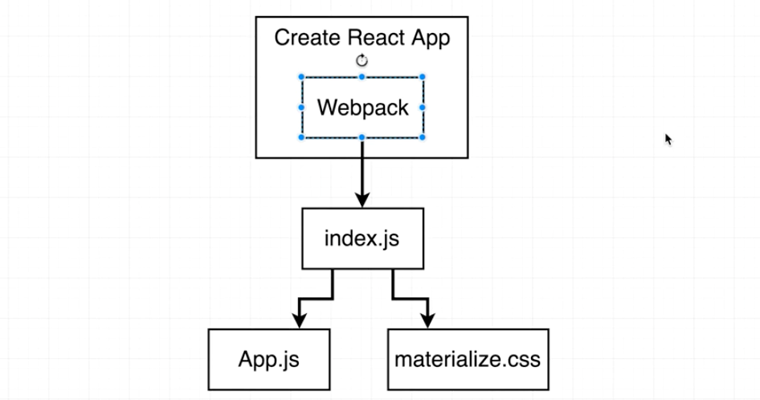
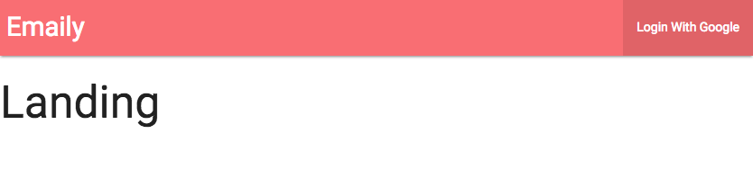
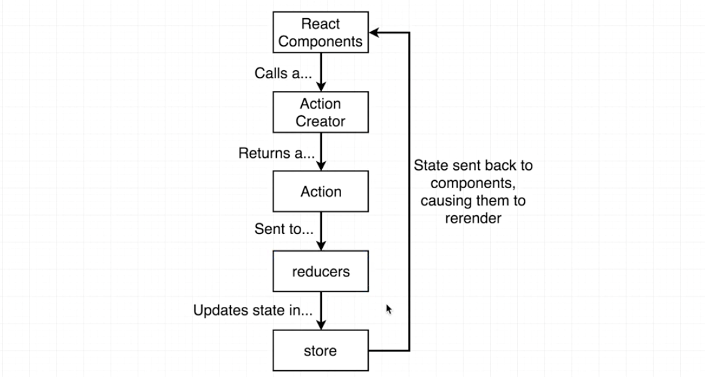
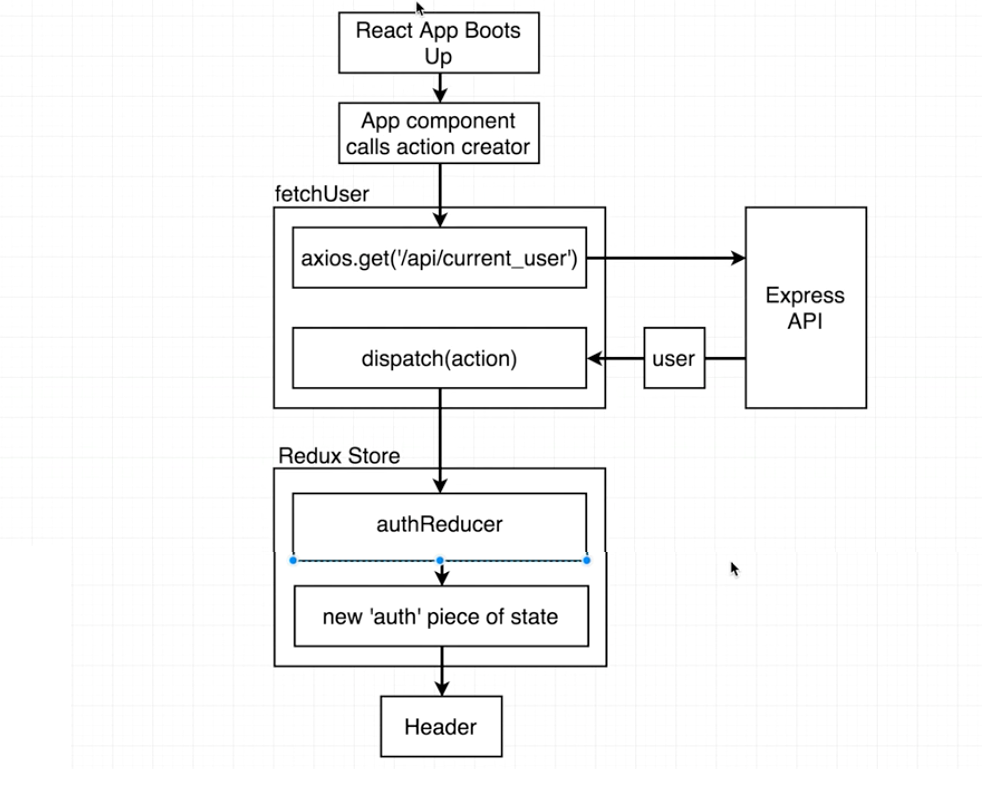
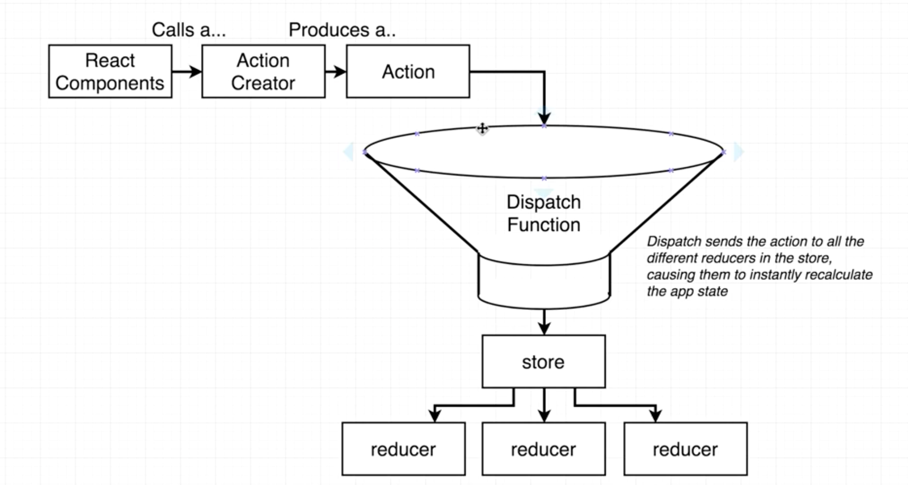
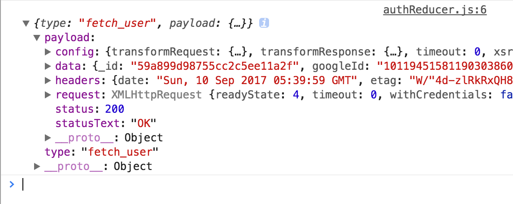
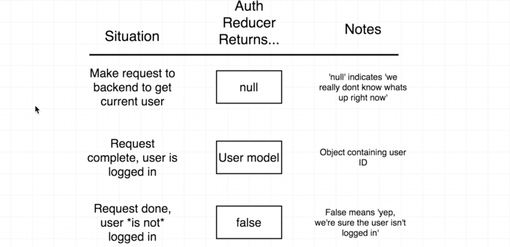
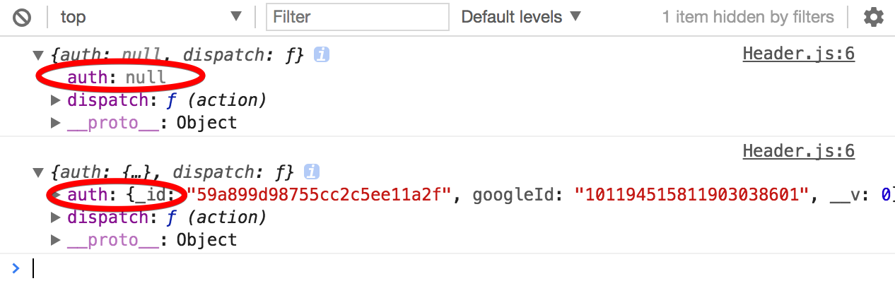

# Developing the Client Side - II

### Contents

1. [React Router Setup](#user-content-1-react-router-setup)
    * [Basic Usage of React Router](#user-content-11-basic-usage-of-react-router)
    * [Always Visible Components](#user-content-12-always-visible-components)
2. [Header Component Implementation](#user-content-2-header-component-implementation)
    * [Separate Header Component Out](#user-content-21-separate-header-component-out)
    * [Materialize CSS with Webpack](#user-content-22-materialize-css-with-webpack)
    * [Header Design](#user-content-23-header-design)
3. [Communication between React and Server](#)
    * [Current User API](#)
    * [Additional Proxy Rules](#)
    * [Basics of Redux Thunk](#)
    * [Import the Action Creator to Component](#)
    * [Get Communicated to the Reducers](#)
    * [Refactor the Action Creator to Async/Await](#)
    * [AuthReducer Return Values](#)
4. [Access State in Header](#)

---

### 1. React Router Setup

#### 1.1. Basic Usage of React Router

Based on the route a user is visiting, we want to show different components on the screen. For example, we want to show `Header` and `Landing` components in the landing page:


So we'll setup several different routes in our application. A route is a pairing or a rule between the address that the user is looking at and the components that should be displayed.

Remember `./client/src/components/App.js` is responsible for all the view-layer setup.

```javascript
// ./client/src/components/App.js
//---------------------------------------------------------
// BrowserRouter: Brain of react-router, it tells react-router how to behave.
// Route: A react component to setup a rule btw a certain route and some components to be displayed.
import { BrowserRouter, Route } from 'react-router-dom';
// Use some dummy components for now
const Header = () => <h2>Header</h2>;
const Dashboard = () => <h2>Dashboard</h2>;
const SurveyNew = () => <h2>SurveyNew</h2>;
const Landing = () => <h2>Landing</h2>;
// We'll leave the outside 'div' for further css purpose.
// Note that 'BrowserRouter' expects to have at most one child. So we need a 'div' in it.
const App = () => {
  return (
    <div>
      <BrowserRouter>
        <div>
          {/* Route for Landing Page */}
          <Route path="/" component={Landing} />
        </div>
      </BrowserRouter>
    </div>
  );
};
```

#### 1.2. Always Visible Components

We can use the same way described above to add two new routes for survey and dashboard.

```javascript
// ./client/src/components/App.js
//---------------------------------------------------------
const App = () => {
  return (
    <div>
      <BrowserRouter>
        <div>
          {/* Route for Landing Page */}
          <Route path="/" component={Landing} />
          {/* Route for Landing Page */}
          <Route path="/surveys" component={Dashboard} />
        </div>
      </BrowserRouter>
    </div>
  );
};
```

If we go to [http://localhost:3000/surveys](http://localhost:3000/surveys), both the Landing and Dashboard components will be displayed.

The reason is straight-forward: Whenever react-router decides what set of components to be displayed, it will take current url and try to match every single route to the current route. So `'/'` is contained in `'/surveys'`. We can pass in `exact` into the `Route` tag to avoid this.

```javascript
// ./client/src/components/App.js
//---------------------------------------------------------
// Pass 'exact' is the same as: exact="true"
const App = () => {
  return (
    <div>
      <BrowserRouter>
        <div>
          {/* Header will always be displayed */}
          <Header />
          {/* Route for Landing Page */}
          <Route exact path="/" component={Landing} />
          {/* Route for Dashboard */}
          <Route exact path="/surveys" component={Dashboard} />
          {/* Route for New Survey Page */}
          <Route path="/surveys/new" component={SurveyNew} />
        </div>
      </BrowserRouter>
    </div>
  );
};
```

We'll break the `Header` component out to a separate component and make sure we can decide whether or not the user is logged in.

---

### 2. Header Component Implementation

#### 2.1. Separate Header Component Out

Instead of use a dummy variable in `'./client/src/components/App.js'`, let's create a separate file `./client/src/components/Header.js` and create a class-based component.

We just want a class-based component since we don't need to use component-level state here and a functional-based component might be messy.

```javascript
// ./client/src/components/Header.js
//---------------------------------------------------------
import React, { Component } from 'react';
class Header extends Component {
  render() {
    return <div>Header</div>;
  }
}
export default Header;
```

Let's then import it in ./client/src/components/App.js and replace our dummy variable:
```javascript
// ./client/src/components/App.js
//---------------------------------------------------------
import Header from './Header';
```

#### 2.2. Materialize CSS with Webpack

[Materialize CSS](http://materializecss.com/) is a famous CSS framework by any type of front-end JS framework. Note that the JavaScript part of Materialize CSS might not work properly with React. We can also use other frameworks like [Material-UI](http://www.material-ui.com/#/). But `Material-UI` uses javascript-based styling, which is not easy to change the layout. So we choose `Materialize CSS`.

Lets install `Materialize CSS` using `npm` instead of a `link` tag: [http://materializecss.com/getting-started.html](http://materializecss.com/getting-started.html).

```
cd client
npm install --save materialize-css
```

When we created our project with `create-react-app` we automatically got some infrastructure inside our project that configures and makes use of webpack, which is a `module loader`.

Webpack can concatenate all the files together and arrange these files into very few generated files.



We want to use `./client/node_modules/materialize-css/dist/css/materialize.min.css`. Write an import statement in our `./client/src/index.js` file and `Webpack` will notice that we want to include a css file. It will then generate a css file.

```javascript
// ./client/src/index.js
//---------------------------------------------------------
// Webpack assumes you'll specify a npm_module installed in './client/npm_modules/'
import "materialize-css/dist/css/materialize.min.css";
```

#### 2.3. Header Design

We now included materialize css in our application. Let's design our header.

```javascript
// ./client/src/components/Header.js
//---------------------------------------------------------
class Header extends Component {
  render() {
    return (
      <nav>
        <div className="nav-wrapper">
          <a className="left brand-logo">Emaily</a>
          <ul className="right">
            <li>
              <a>Login With Google</a>
            </li>
          </ul>
        </div>
      </nav>
    );
  }
}
```
Our application header looks better:



Added a container class to the outside div:
```javascript
// ./client/src/components/App.js
//---------------------------------------------------------
const App = () => {
  return (
    <div className="container">
      ...
  );
};
```
---

### 3. Communication between React and Server

#### 3.1. Current User API

Header component should display different content if a user is logged in or not logged in. Remember we have a route in our Express server file `./routes/authRoutes.js`:

If a user is logged in, the route `/api/current_user` will response with the user signed in. This is the way to figure out whether a user is signed in.

When the application boosts up, we'll make a request to the route `/api/current_user` to see whether or not the user is logged in.

Here is diagram of how to communicate between our React app and the server side:



So we need to make an action creator that makes a request over to the route handler on our server.

#### 3.2. Additional Proxy Rules

Here is a diagram of how to figure out whether a user is signed in:

1. When React app started, the App component should call an action creator.
2. The action creator should make an ajax request to the backend asking whether or not a user is logged in.
3. The action creator has a name `'fetchUser'`, we'll use `axios` to make the request.
4. Once we get the request back, we'll use a library `'redux-thunk'` to dispatch an action off to all the different reducers in our app.
5. Our `authReducer` will look at that action and update the state.
6. Update `Header` component based on the new state.



Install `axios` to make ajax requests:

```
cd client
npm install --save axios redux-thunk
```

Import `redux-thunk` into `./client/src/index.js` and use it as a middleware to create the redux store:
```javascript
// ./client/src/index.js
//---------------------------------------------------------
import reduxThunk from 'redux-thunk';
const store = createStore(reducers, {}, applyMiddleware(reduxThunk));
```

Create a new folder storing all our action creators: `./client/src/actions/`:

* `./client/src/actions/index.js`: To organize all our action creators in the folder. (We'll refactor it later)
* `./client/src/actions/types.js`: Store all action types

```javascript
// ./client/src/actions/types.js
//---------------------------------------------------------
export const FETCH_USER = "fetch_user";

// ./client/src/actions/index.js
//---------------------------------------------------------
import axios from 'axios';
import { FETCH_USER } from './types';
export const fetchUser = () => {
  axios.get('/api/current_user');
};
```

We need another proxy rule to handle to request to the route `'/api/current_user'`.

```javascript
// ./client/package.json
//---------------------------------------------------------
...
"proxy": {
  "/auth/google": {
    "target": "http://localhost:5000"
  },
  "/api/*": {
    "target": "http://localhost:5000"
  }
},
...
```

#### 3.3. Basics of Redux Thunk

The action creator we created will return an action and pass it to all reducers. The action is a javascript object with a `type` property.

By default, an action creator should return an action immediately. `Redux-thunk` can break this rule.



Instead of returning an action, the action creator will produce an action and pass it to a dispatch function. If we call the dispatch function with an action, the action will be automatically passed into all the reducers.

`Redux-thunk` allows us to have direct access to the dispatch function. We can call it manually anytime.

```javascript
// ./client/src/actions/index.js
//---------------------------------------------------------
// Modify the function to use 'redux-thunk'
// Return a function. When the function is executed, make the request.
const fetchUser = () => {
  return function(dispatch) {
    axios
      .get('/api/current_user')
      .then(res => dispatch({ type: FETCH_USER, payload: res }));
  };
};
```

If `redux-thunk` sees we returned a function instead of an action from an action creator, `redux-thunk` will automatically call this function and pass in the dispatch function as an argument. The advantage is that we can then call the dispatch function anytime we want. (Here we want to dispatch the action after the ajax request is finished)

#### 3.4. Import the Action Creator to Component

We have created an action creator `fetchUser`, the first question is where should we add this action creator to. We should add it to `./client/src/components/App.js`.

The `App` component is now a functional component, we only want to fetch the user the first time the component is rendered to the screen. So it's better to refactor the component to be class-based. That way we can use life-cycle methods to fetch the users.

```javascript
// ./client/src/components/App.js
//---------------------------------------------------------
import React, { Component } from "react";
import { connect } from "react-redux"; // This gives the component the ability to call action creators.
import * as actions from "../actions";

class App extends Component {
  componentDidMount() {
    this.props.fetchUser();
  }
  render() {
    return (
      <div className="container">
        <BrowserRouter>
          <div>
            {/* Header will always be displayed */}
            <Header />
            {/* Route for Landing Page */}
            <Route exact path="/" component={Landing} />
            {/* Route for Dashboard */}
            <Route exact path="/surveys" component={Dashboard} />
            {/* Route for New Survey Page */}
            <Route path="/surveys/new" component={SurveyNew} />
          </div>
        </BrowserRouter>
      </div>
    );
  }
}

/**
 * @param mapStateToProps
 * @param actions that will be assigned to the component as props
 */
export default connect(null, actions)(App);
```

#### 3.5. Get Communicated to the Reducers

Make sure the action creator `fetchUser()` can access to the reducer in `./client/src/reducers/authReducer.js`:

```javascript
// ./client/src/reducers/authReducer.js
//---------------------------------------------------------
export default function(state = {}, action) {
  console.log(action);
  ...
}
```

We can now see the action in a browser console. This is an `axios` response object. Its `data` argument is the actual json object that the server sent to us.



Now everything looks good.

#### 3.6. Refactor the Action Creator to Async/Await

Let's refactor our action creator to make it better:

```javascript
// ./client/src/actions/index.js
//---------------------------------------------------------
// Return an async function whose argument is 'dispatch'
export const fetchUser = () => async dispatch => {
  const res = await axios.get("/api/current_user");
  dispatch({ type: FETCH_USER, payload: res.data }); // res.data is the response json object.
};
```

#### 3.7. AuthReducer Return Values

Let's modify the `./client/src/reducers/authReducer.js` to complete our reducer. But before that, we have to consider three situations:

* While we're waiting for the request to finish, we should return `null`.
* If the user is logged in, return the `User` model.
* If not logged in, return `false`.



```javascript
// ./client/src/reducers/authReducer.js
//---------------------------------------------------------
import { FETCH_USER } from '../actions/types';

export default function(state = null, action) {
  switch (action.type) {
    case FETCH_USER:
      // action.payload will be an empty string if the user is not logged in.
      // It is the user model if the user is logged in.
      return action.payload || false;
    default:
      return state; // No change to our state
  }
}
```

---

### 4. Access State in Header

We want to access the state in our `Header` component. So we need to hook it up with our redux store: import `connect` helper and use `mapStateToProps()`.

```javascript
// ./client/src/components/Header.js
//---------------------------------------------------------
import { connect } from "react-redux";

class Header extends Component {
  render() {
    console.log(this.props);
    return (...);
  }
}

function mapStateToProps(state) {
  // We just care about the 'auth' piece
  return { auth: state.auth };
}
// Equivalent to (by destruction):
// function mapStateToProps({ auth }) { return { auth }; }

export default connect(mapStateToProps)(Header);
```

By printing out the `props`, we can see two objects in our browser console. The first `auth` property is null, which means we are waiting for the response. The second `auth` property is a user object.



Let's then modify the header:

```javascript
// ./client/src/components/Header.js
//---------------------------------------------------------
class Header extends Component {
  renderContent() {
    switch (this.props.auth) {
      case null:
        return "Still deciding...";
      case false:
        return "I'm logged out.";
      default:
        return "I'm logged in.";
    }
  }

  render() {
    return (
      <nav>
        <div className="nav-wrapper">
          <a className="left brand-logo">Emaily</a>
          <ul className="right">{this.renderContent()}</ul>
        </div>
      </nav>
    );
  }
}
```
