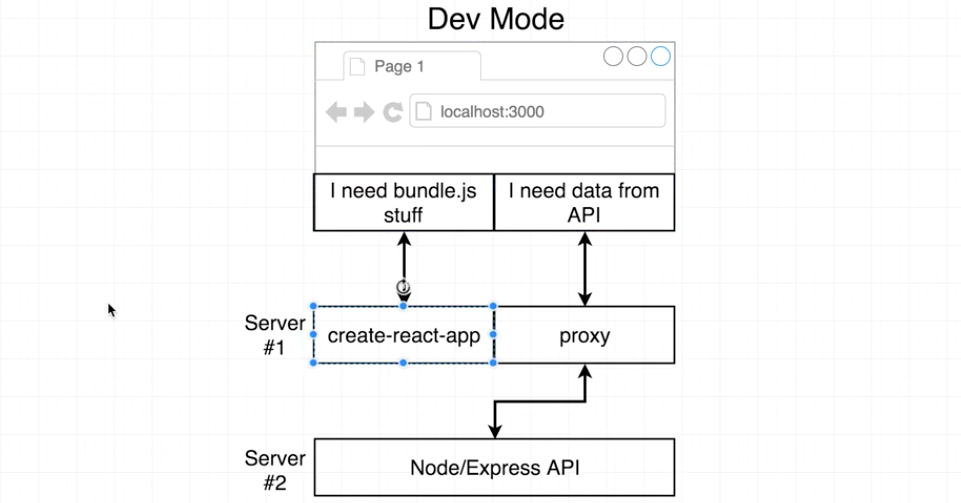
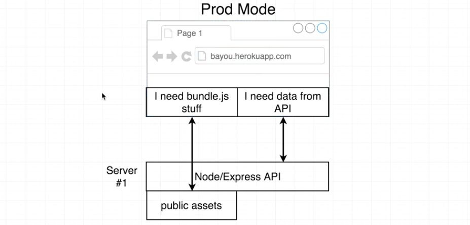
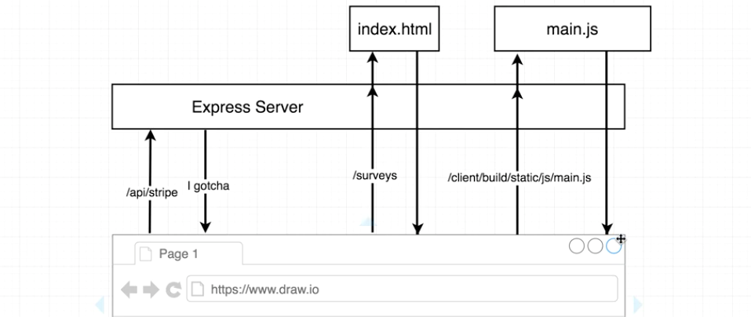
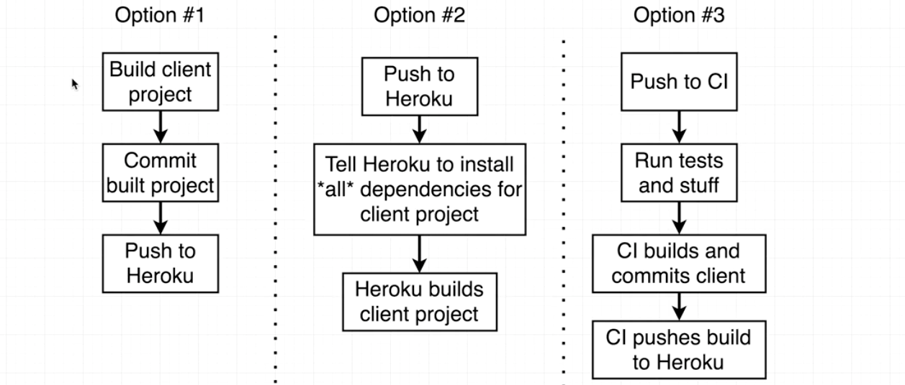
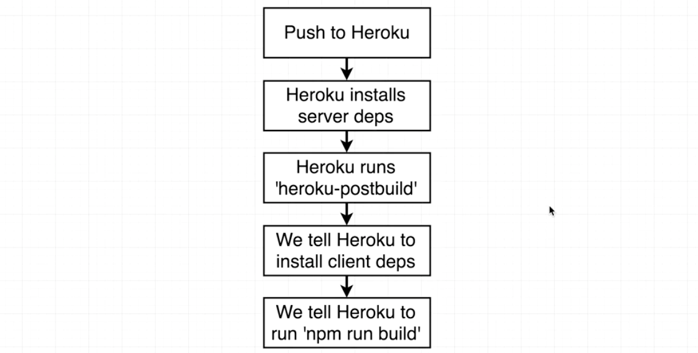
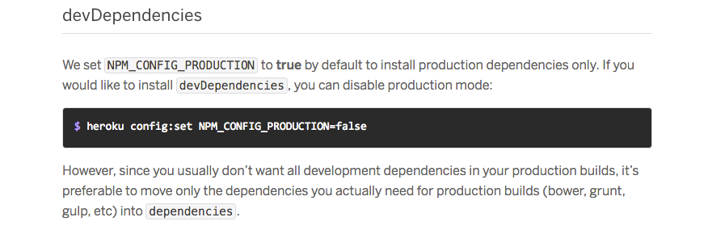
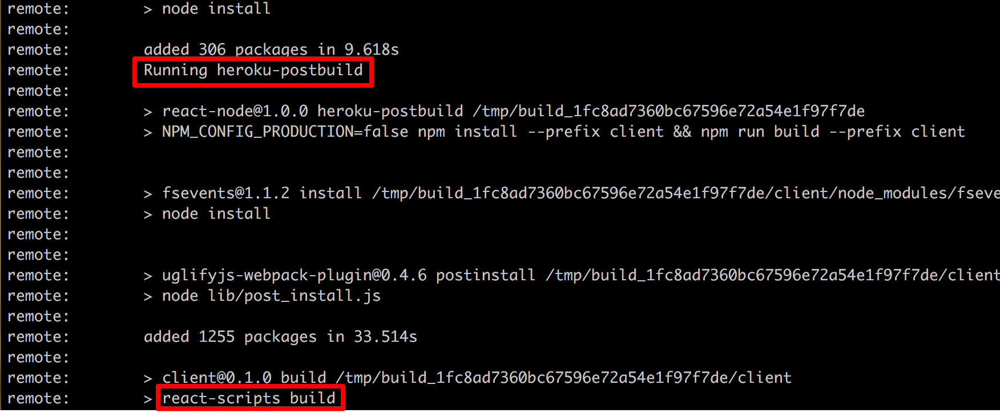

# Back End to Front End Routing in Production

### Contents

1. [Express with Create-React-App in Production](#user-content-1-express-with-create-react-app-in-production)
2. [Routing in Production](#user-content-2-routing-in-production)
3. [Deployment Options](#user-content-3-deployment-options)
4. [Adding in a Heroku Build Step](#user-content-4-adding-in-a-heroku-build-step)

---

### 1. Express with Create-React-App in Production

We have wrapped up billing for both back-end and front-end of our application. Let's do another deployment to Heroku before moving on to the next feature.

The Express server's behavior is goint to slightly change between production and development. Recall the diagrams below for development mode: The `create-react-app` server is responsible for serving up all the assets, like the html files and js files.



In the production environment, we want the Express server to respond with all the relevant assets because that the whole `create-react-app` layer has now disappeared.



In the past, we ran the `build` command to build a production-version of all the assets in the client side. When we want to deploy our app some time, we always need to run the command below:

```
cd client
npm run build
```

The root index file for the production package is `./client/build/index.html`.

Here is a diagram how the Express server serves the client side:



So far we just dealed with route handlers in the Express server (for exmaple `/api/stripe` in the diagram). What happens if we make a `GET` request to the path `/surveys`? `/surveys` is not a route defined in Express. It is defined in our `react-router` configuration (`./client/src/components/App.js`).

**We should instruct the Express server that if it sees a request for some route that doesn't defined in Express route handlers, it is trying to access a route that is defined by `react-router`.**

---

### 2. Routing in Production

We're now going to set up our Express server to make sure that it understands that there are some routes might not have a specific route handler for.

```javascript
// ./index.js
//---------------------------------------------------------
// Instruct Express to Handle Routes Defined in Front-end
// only run in production
if (process.env.NODE_ENV == "production") {
  // Express will serve up production assets like our 'main.js' file
  // If any route comes in and we do not understand,
  // then look into 'client/build' and see if there is a file that matches the route.
  app.use(express.static("client/build"));
  // Express will server up the './client/build/index.html' file if it doesn't recognize the route
  const path = require("path");
  app.get("*", (req, res) => {
    res.sendFile(path.resolve(__dirname, "client", "build", "index.html"));
  });
}
```

---

### 3. Deployment Options

We want to make sure that any updates we made to the client side are correctly reflected on our production server. Every time we run `npm run build`, we can get a new build for the client side. We have to run it every time when we want to deploy our appliction.

By default `build` assets will not be commited by `create-react-app` to git. We have 3 options to deploy our app:



* **Option 1.** Commit built project and push it all to Heroku.
* **Option 2.** The entire `build` process will be executed on Heroku servers. This is not a good option since we need to install **ALL** dependencies that `create-react-app` relies upon (`Webpack`, `Babel`, ...) in Heroku server.
* **Option 3.** We make use of a third-party server to build the application. A CI (continuous integration) server is a server that has the ability to run test or checks over your code base. We can config a CI server to build the project: [Cricle CI](https://circleci.com/)

Option 3 is widely used by some companys, but it's overkill for our small project. We'll use option 2 here.

---

### 4. Adding in a Heroku Build Step

Here is the flow we'll go through:



1. We'll commit all the files to git and push them to Heroku.
2. When we push them to Heroku, it will automatically install all the server dependencies.
3. Automatically runs a script: `heroku-postbuild`.
4. Inside the script in step 3, we can instruct Heroku to install client dependencies.
5. We tell Heroku to run `npm run build`.

Let's read the documentation to figure out how to instruct Heroku to install client-side dependencies: [Customizing the build process](https://devcenter.heroku.com/articles/nodejs-support#customizing-the-build-process)

We'll use `heroku-postbuild` to build the client-size assets after npm modules are installed.



Add a new script in `./package.json`, this is the only `package.json` file that Heroku cares about.

```javascript
// ./package.json
//---------------------------------------------------------
...
  "scripts": {
    "start": "node index.js",
    "server": "nodemon index.js",
    "client": "npm run start --prefix client",
    "dev": "concurrently \"npm run server\" \"npm run client\"",
    // This script will be automatically called after the server dependencies are installed.
    // We want to run 'npm install' only inside './client/', not the current dir.
    "heroku-postbuild": "NPM_CONFIG_PRODUCTION=false npm install --prefix client && npm run build --prefix client"
  },
...
```

Then let's deploy our app again. Remember to run `heroku logs` if you have errors.

```
git push heroku master
```

Note that we have the following logs in the terminal, which means that our `heroku-postbuild` script is running successfully.



Test the app with `heroku open`.

Note that if we go to [https://vast-garden-42186.herokuapp.com/surveys](https://vast-garden-42186.herokuapp.com/surveys), the entire page will be refreshed, which is a new http request. The reason is that Express has no idea what this route is about. It just load the html document. The html file load related js files and rendered the `Landing` component then.

But if you click some links and `react-router` will render related components very quickly, without refreshing the whole page.
