# Mongoose for Survey Creation

### Contents

1. [Intro to Survey](#user-content-1-intro-to-survey)
    * [Survey Overview](#user-content-11-survey-overview)
    * [Server Routes](#user-content-12-server-routes)
    * [Survey Model](#user-content-13-survey-model)
2. [Database Setup for Surveys](#user-content-2-database-setup-for-surveys)
    * [Create Mongoose Class](#user-content-21-create-mongoose-class)
    * [Model Deficiencies](#user-content-22-model-deficiencies)
    * [Limitations of Subdocument Collections](#user-content-23-limitations-of-subdocument-collections)
    * [Setting up SubDocs](#user-content-24-setting-up-subdocs)
3. [Back End Setup for Surveys](#user-content-3-back-end-setup-for-surveys)
    * [Survey Creation Route Handler](#user-content-31-survey-creation-route-handler)
    * [Verifying Minimum Credits](#user-content-32-verifying-minimum-credits)
    * [Creating Surveys](#user-content-33-creating-surveys)
4. [Sending Emails](#user-content-4-sending-emails)
    * [Creating Mailers](#user-content-41-creating-mailers)
    * [SendGrid Setup](#user-content-42-sendgrid-setup)
    * [Mailer Setup](#user-content-43-mailer-setup)
    * [Mailer in Use](#user-content-44-mailer-in-use)
    * [Mailer Constructor](#user-content-45-mailer-constructor)
    * [Testing Email Sending](#user-content-46-testing-email-sending)
    * [Improving the Email Template](#user-content-47-improving-the-email-template)
    * [Polish in the Route Handler](#user-content-48-polish-in-the-route-handler)
    * [Verifying SendGrid Click Tracking](#user-content-49-verifying-sendgrid-click-tracking)

---

### 1. Intro to Survey

#### 1.1. Survey Overview

This is the flow of exactly what's going to happen when the user creates a survey:

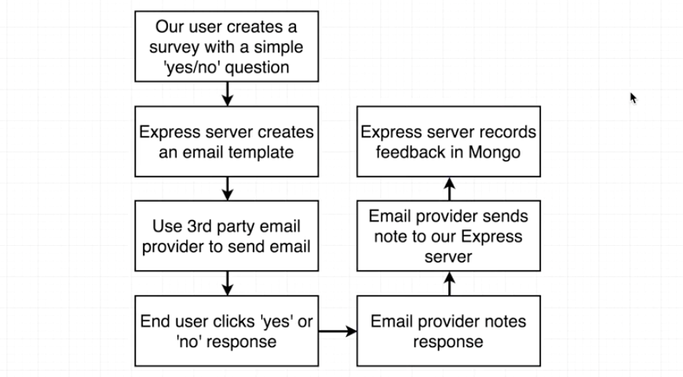

The sample email contains a question and two buttons `yes` and `no`. What part of our application do we need to touch for surveys?

#### 1.2. Server Routes

Here are 3 route handlers we need for our Express server:

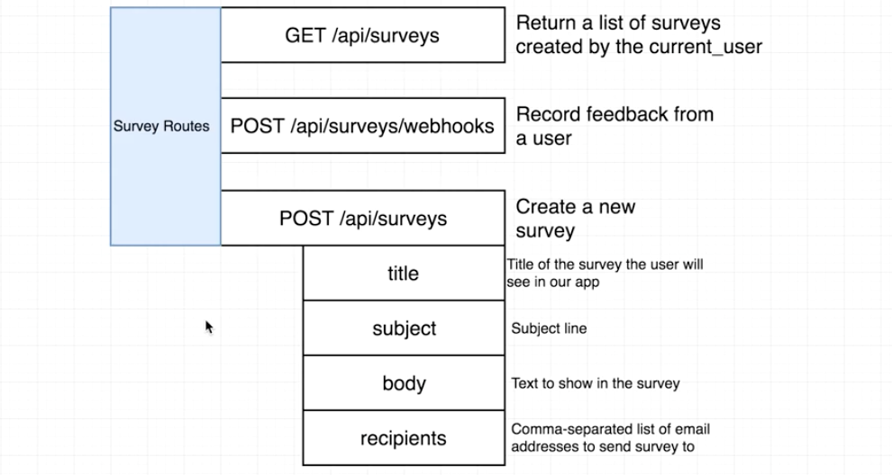

* `GET /api/surveys:` Find all the surveys.
* `POST /api/surveys/webhooks`: Record the feedback to database.
* `POST /api/surveys:` Create a survey and email to users. It contains the following fields:
  * title
  * subject
  * body
  * recipients: comma separated email address

#### 1.3. Survey Model

We need to save surveys to our database. Remember we need to create a mongoose class to create a collection of records (like database tables) inside of our database:

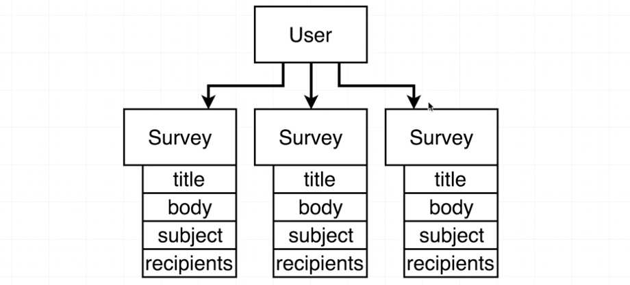

Since we want to know which user a survey belongs to, there should be some link between users and surveys.

---

### 2. Database Setup for Surveys

#### 2.1. Create Mongoose Class

Let's create the `Survey` class first in mongoose:

```javascript
// ./models/Survey.js
//---------------------------------------------------------
const mongoose = require("mongoose");
const { Schema } = mongoose;
const surveySchema = new Schema({
  title: String,
  body: String,
  subject: String,
  recipients: [String] // Array of strings,
  yes: { type: Number, default: 0 }, // How many users responded with `yes`
  no: { type: Number, default: 0 },
  dateSent: Date,
  lastResponded: Date
});
// Register this schema with mongoose
mongoose.model("surveys", surveySchema);
//---------------------------------------------------------
// ./index.js
//---------------------------------------------------------
// Import the mongoose model we just created:
require("./models/Survey");
```

#### 2.2. Model Deficiencies

We saved recipients as a list of strings in the schema we just created. But this is not a perfect solution.

When a user clicks the button in the email, we need to record the action so that we know who clicks `yes` and how many user have chosen `yes`. If one user clicks the button for 20 times, we don't want to increase the count by 20.

Thus we need a way to identify each user and record who has responded to the email. Here is what we're going to do:


Inside the `recipients` property, we'll embed a sub-document collection. Each document contains a field `clicked` to record whether the user has clicked the buttons.

#### 2.3. Limitations of Subdocument Collections

Let's discuss more about subdocument collections. Recall we created a Surveys collection by defining a mongoose class model (schema).

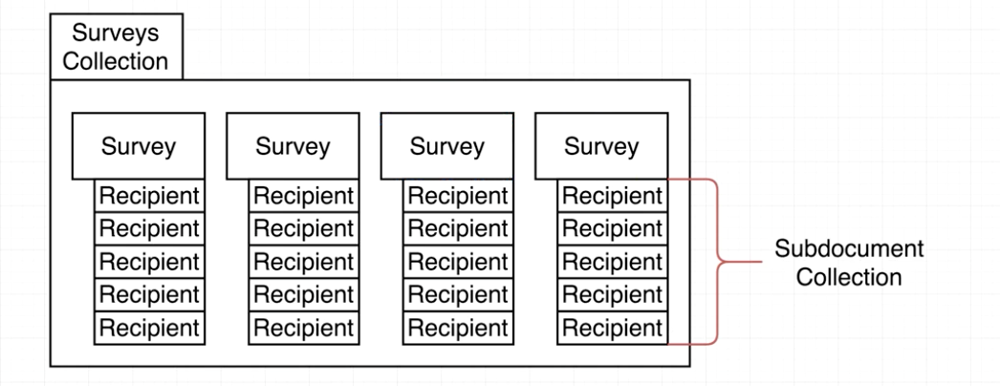

We use subdocument collections when we want to have a very clear association between two give records. A recipient document only belongs to its parent survey. But as we mentioned before, a user may have multiple surveys, why don't we make surveys as a subdocument collection for `Users`?

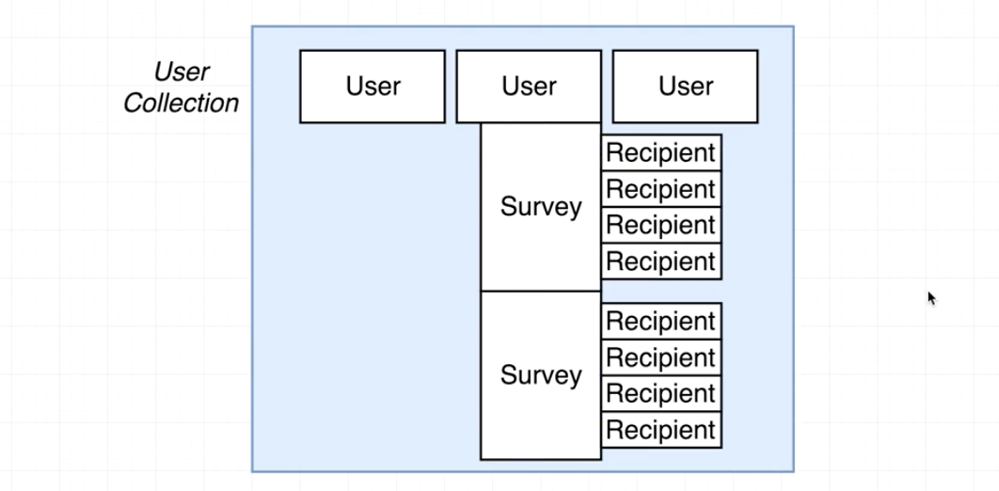

The practical reason is that each record is actually a document in `MongoDB`. `MongoDB` has a limit for each document which is 4MB.

#### 2.4. Setting up SubDocs

Make a new file for recipients:

```javascript
// ./models/Recipient.js
//---------------------------------------------------------
const mongoose = require("mongoose");
const { Schema } = mongoose;
const recipientSchema = new Schema({
  email: String,
  responded: { type: Boolean, default: false }
});
// Not register this schema with mongoose, we need to export it.
module.exports = recipientSchema;
```

Then import the schema to `./models/Survey.js` and use the schema to setup the model. Remember we also want to add another property `_user` to record which user the survey belongs to.

```javascript
// ./models/Survey.js
//---------------------------------------------------------
const RecipientSchema = require('./Recipient');
const surveySchema = new Schema({
  ...
  recipients: [RecipientSchema], // A list of schemas
  ...
  _user: { type: Schema.Types.ObjectId, ref: 'User' } // The user this survey belongs to
});
```

---

### 3. Back End Setup for Surveys

#### 3.1. Survey Creation Route Handler

After setting up the database, let's move on to the Express server. Create a new file `./routes/surveyRoutes.js`. Before creating a survey, we need to make sure that the user is logged in and he has enough credits. Remember we have the middleware in `./middlewares/requireLogin.js` to check whether a user is logged in.

```javascript
// ./routes/surveyRoutes.js
//---------------------------------------------------------
const reuqireLogin = require("../middlewares/requireLogin");
module.exports = app => {
  // Create a new survey
  // Pass in the middleware to ensure logged in
  app.post("/api/surveys", reuqireLogin, (req, res) => {
    // Make sure the user is logged in
    // Check the user have enough credits
  });
};
```

Don't forget to set up the new route handler in `./index.js`:

```javascript
// ./index.js
//---------------------------------------------------------
require("./routes/surveyRoutes")(app);
```

#### 3.2. Verifying Minimum Credits

Since we may check user credits for many other route handlers in the future, we'll make a new middleware to do that:

```javascript
// ./middlewares/requireCredits.js
//---------------------------------------------------------
module.exports = (req, res, next) => {
  if (req.user.credits < 1) {
    return res.status(403).send({ error: "You don't have enough credits." });
  }
  next();
};
```

Apply that new middleware in `./routes/surveyRoutes.js`:

```javascript
// ./routes/surveyRoutes.js
//---------------------------------------------------------
const reuqireLogin = require("../middlewares/requireLogin");
const reuqireCredits = require("../middlewares/reuqireCredits");
module.exports = app => {
  // Create a new survey
  // We can pass as many middlewares as we want
  // Make sure the user is logged in
  // Check the user have enough credits
  app.post("/api/surveys", reuqireLogin, reuqireCredits, (req, res) => {
  });
};
```

#### 3.3. Creating Surveys

Let's create surveys and save them to database in the request handler.

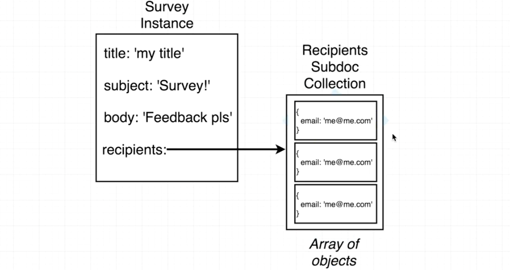

The challenge is to deal with the sub-documents `recipients` for the survey. We need to define `email` property for each recipient. If we pass in objects, mongoose will create the sub-docs for us automatically. Here is the flow:

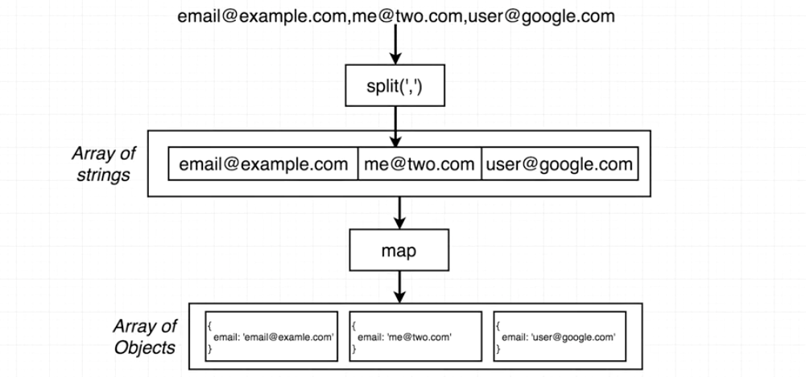

```javascript
// ./routes/surveyRoutes.js
//---------------------------------------------------------
const mongoose = require("mongoose");
// Access database
const Survey = mongoose.model("surveys");
module.exports = app => {
  app.post("/api/surveys", reuqireLogin, reuqireCredits, (req, res) => {
    // All the parameters for the POST request are in 'req.body'
    const { title, subject, body, recipients } = req.body;
    // Create an instance of the 'Survey' in memory (not saved yet)
    const survey = new Survey({
      title, // Equivalent to: title: title
      subject,
      body,
      recipients: recipients.split(',').map(email => ({ email: email.trim() })),
      _user: req.user.id, // ID generated by mongoose
      dateSent: Date.now()
    });
  });
};
```

---

### 4. Sending Emails

#### 4.1. Creating Mailers

At the same time we create the survey, we also want to send an email to all the recipients. Here is the process:

1. Create new survey instance
2. Attempt to create and send email
3. Email sent successfully?
4. Save survey
5. survey handler complete

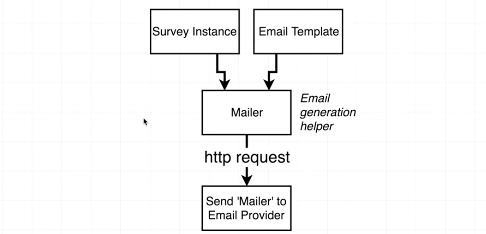

The `Survey` instance is the data-layer for the email, we also need the view layer: email template.

In the last diagram, the 'http request' step is complicated. Let's look at the bad way to communicate the mailer to the provider first:

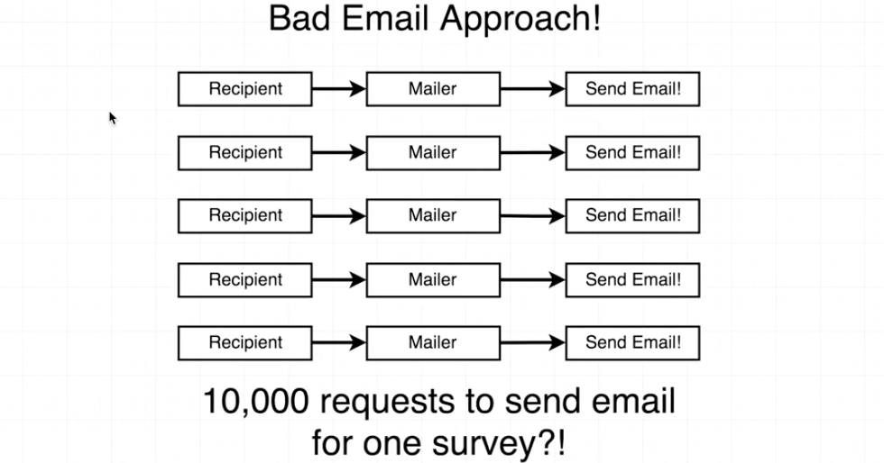

For every single recipient, we create a single mailer object and send it to the provider. This is bad since we need many requests. We want to do a batch operation:

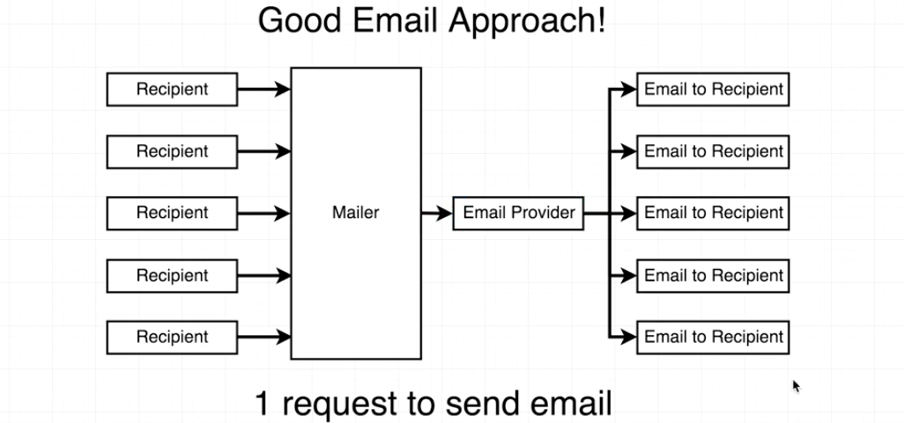

We want to use the second option, but there are some challenges:

If we use the same mailer for all the users, we may don't want to send exactly same emails to all the users, since we need to record who clicks the button. We'll get everything done later.

The email provider we'll use is [SendGrid](https://sendgrid.com/). For each email sent through `SendGird`, he will look inside the body and replace all the links by customized links to their server. When a user clicks the linke, `SendGird` will collect the data and then send it to the actually original destination defined by us in the mail body.

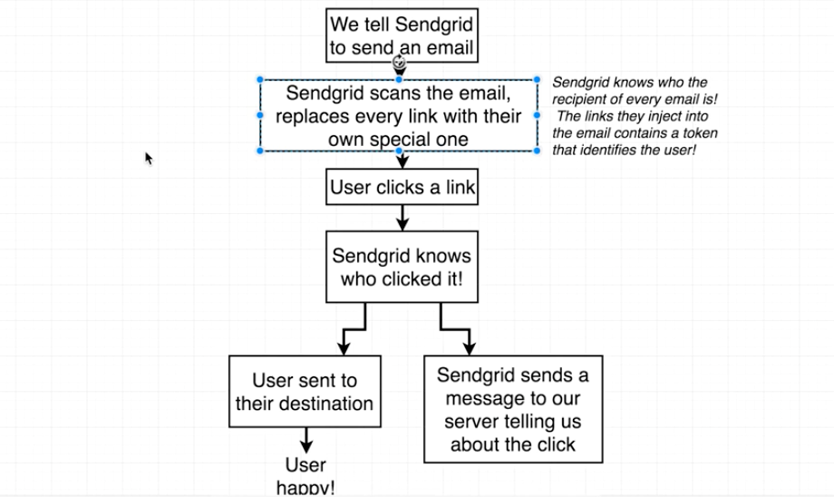

#### 4.2. SendGrid Setup

Let's sign up SendGrid and let it send emails for us. Create an API key in the dashboard:

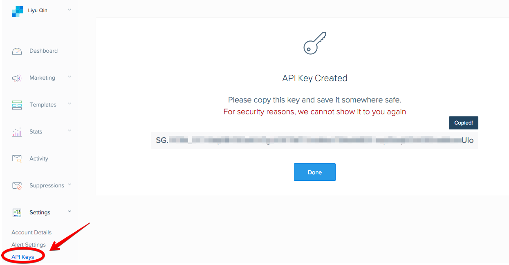

Let's set the API key in both development and production environment:

```javascript
// ./config/dev.js
//---------------------------------------------------------
module.exports = {
  ...
  sendGridKey:
    "SG.xxxxxxxxxxxxxxxxxx"
};
//---------------------------------------------------------
// ./config/prod.js
//---------------------------------------------------------
module.exports = {
  ...
  sendGridKey: process.env.SEND_GRID_KEY
};
```

Don't forget to set the environment key for Heroku:

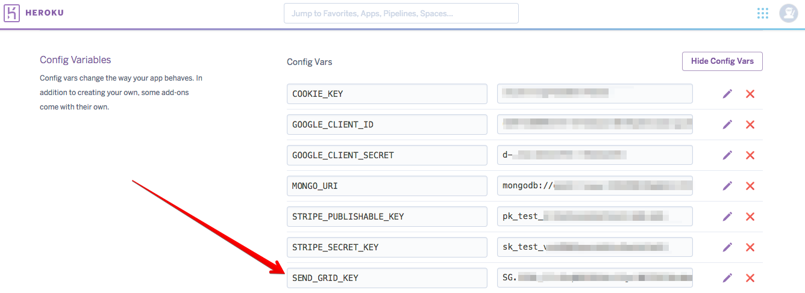

The next step is to install the SendGrid helper module:

```
npm install --save sendgrid
```

#### 4.3. Mailer Setup

When we want to send an email, we need to create an instance of the `Mailer` class:

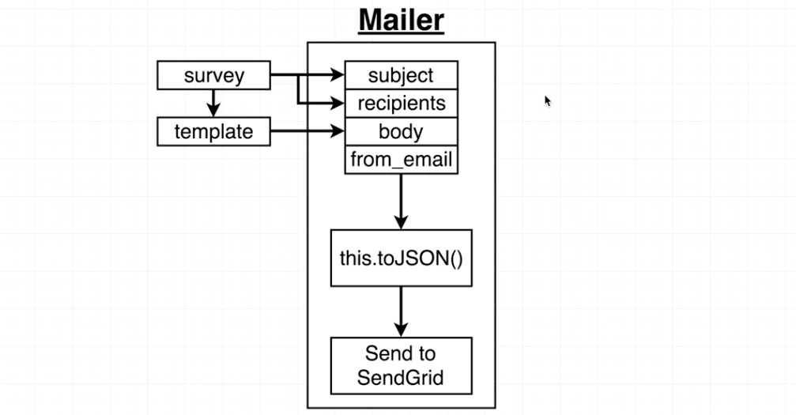

The template will provide some html code as the `body` part of the mailer. After we set up all the properties, we need to call the function `toJSON()` and send it to SendGrid.

Create a new service file for sending email: `./services/Mailer.js`. Note the file name is capitalized because it exports a class `Mailer`, while `./services/passport.js` doesn't export anything.

```javascript
// ./services/Mailer.js
//---------------------------------------------------------
const sendgrid = require("sendgrid");
const helper = sendgrid.mail;
// Import API key
const keys = require("../config/keys");
// 'helper.Mailer' takes lots of configurations for a mailer.
// We want to add customizations to it.
class Mailer extends helper.Mailer {}
module.exports = Mailer;
```

#### 4.4. Mailer in Use

We haven't finished up constructing the `Mailer` class. Let's assume we have done that and take a look at where it should be used first.

It should be used in the route handler and send email right after a survey is created:

```javascript
// ./routes/surveyRoutes.js
//---------------------------------------------------------
const Mailer = require("../services/Mailer");
module.exports = app => {
  app.post("/api/surveys", reuqireLogin, requireCredits, (req, res) => {
    // Created a new survey
    ...
    // Send an email
    // Pass in survey data and the html template
    const mailer = new Mailer(survey, template);
  });
};
```

Note that we passed in `template` as the second argument for `Mailer()` above. Let's create a template: `./services/emailTemplates/surveyTemplate.js`. It will export a function and you can get some html code when you call this function.

```javascript
// ./services/emailTemplates/surveyTemplate.js
//---------------------------------------------------------
// It takes the survey as the argument
module.exports = survey => {
  return "<div>" + survey.body + "</div>";
};
```

Then import the template file into route handlers and use it:

```javascript
// ./routes/surveyRoutes.js
//---------------------------------------------------------
const surveyTemplate = require("../services/emailTemplates/surveyTemplate");
module.exports = app => {
  app.post("/api/surveys", reuqireLogin, requireCredits, (req, res) => {
    // Created a new survey
    ...
    // Send an email
    // Pass in survey data and the html template
    const mailer = new Mailer(survey, surveyTemplate(survey));
  });
};
```

#### 4.5. Mailer Constructor

We have seen where to use `Mailer` in the last section, now let's start to implement the `Mailer` class.

```javascript
// ./services/Mailer.js
//---------------------------------------------------------
const sendgrid = require("sendgrid");
const helper = sendgrid.mail;
// Import API key
const keys = require("../config/keys");

// 'helper.Mailer' takes lots of configurations for a mailer.
// We want to add customizations to it.
class Mailer extends helper.Mail {
  // Constructor
  // We just want the first argument to contain several properties. (Here is a survey object)
  // The second argument here is the HTML string
  constructor({ subject, recipients }, content) {
    super(); // Make sure any constructor defined on the parent class (helper.Mail) gets executed.

    this.sgApi = sendgrid(keys.sendGridKey);

    // We have to define the following properties:
    this.from_email = new helper.Email("no-reply@emaily.com");
    this.subject = subject;
    this.body = new helper.Content("text/html", content);
    // Notes that the 'recipients' input is an array of objects defined in "./routes/surveyRoutes.js"
    this.recipients = this.formatAddresses(recipients); // Helper function

    // Register the content
    // 'addContent()' is a built-in function defined in 'helper.Mail'
    this.addContent(this.body);
    // Enable click-tracking
    this.addClickTracking(); // helper function
    // Helper function to format the recipients
    // Take them into the Mailer object.
    this.addRecipients();
  }

  //---------------------------------------------------------------------------
  // Helper function
  //---------------------------------------------------------------------------
  // Extract emails for all object and format them with `helper.Email()`
  formatAddresses(recipients) {
    // When destructuring the input, add additional parenthesis: ({ email })
    return recipients.map(({ email }) => {
      return new helper.Email(email);
    });
  }

  //---------------------------------------------------------------------------
  // Helper function to enable click-tracking
  //---------------------------------------------------------------------------
  addClickTracking() {
    const trackingSettings = new helper.TrackingSettings();
    const clickTracking = new helper.ClickTracking(true, true);

    trackingSettings.setClickTracking(clickTracking);
    this.addTrackingSettings(trackingSettings);
  }

  //---------------------------------------------------------------------------
  // Helper function to format the recipients
  //---------------------------------------------------------------------------
  addRecipients() {
    const personalize = new helper.Personalization();
    this.recipients.forEach(recipient => {
      personalize.addTo(recipient); // Add them to the 'personalize' object
    });
    this.addPersonalization(personalize);
  }

  //---------------------------------------------------------------------------
  // Send it off to SendGrid
  //---------------------------------------------------------------------------
  // Sending email should be async
  async send() {
    const request = this.sgApi.emptyRequest({
      method: "POST",
      path: "/v3/mail/send",
      body: this.toJSON()
    });
    const response = this.sgApi.API(request); // Send it
    return response;
  }
}

module.exports = Mailer;
```

We created a function `send()` in the end, we can call this function in the route handler to actually send the emails:

```javascript
// ./routes/surveyRoutes.js
//---------------------------------------------------------
module.exports = app => {
  app.post("/api/surveys", reuqireLogin, requireCredits, (req, res) => {
    ...
    // Send an email
    const mailer = new Mailer(survey, template);
    mailer.send(); // Send the email by the function 'send()'
  });
};
```

#### 4.6. Testing Email Sending

We have lots of code for sending email, how can we test it. We can use rest clients like [Postman](https://www.getpostman.com/) to make post requests. But this is not the best option since we need the user to login and have enough credit before sending email.

We can just use the `axios` module to make a post request from our client side manually.

```javascript
// ./client/src/index.js
//---------------------------------------------------------
// Test code to make some requests
import axios from "axios";
window.axios = axios;
```

Now if we run our app and go to the browser console, we shoule have access to `axios`:

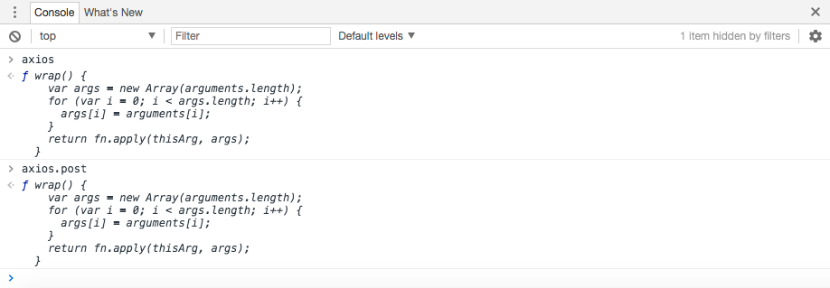

Manually define an object `survey` and call `axios.post()` function in the console. You'll receive an email in the mailbox. We'll get an error in the console since we have not defined the call-back function after sending the email. It'll be fixed soon.

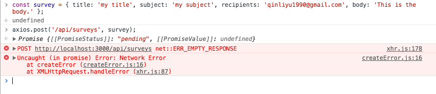

#### 4.7. Improving the Email Template

Remember the body of the email is created by our template file. Let's make it better:

```javascript
// ./services/emailTemplates/surveyTemplate.js
//---------------------------------------------------------
module.exports = survey => {
  return `
    <html>
      <body>
        <div style="text-align:center;">
          <h3>I'd like your input.</h3>
          <p>Please answer the following question:</p>
          <p>${survey.body}</p>
          <div>
            <a href="http://localhost:3000">Yes</a>
          </div>
          <div>
            <a href="http://localhost:3000">No</a>
          </div>
        </div>
      </body>
    </html>
  `;
};
```

Now the email looks better:

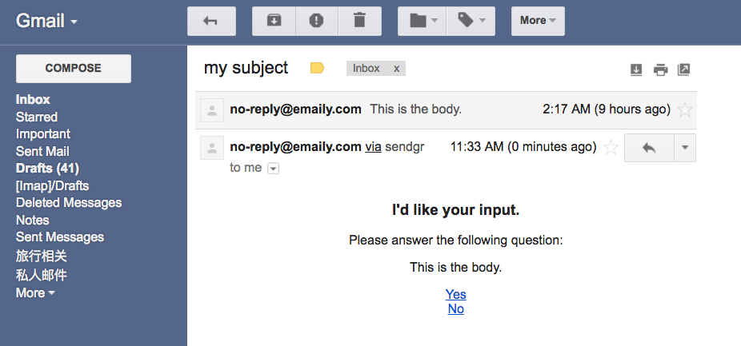

Note that the link in the email is replaced by SendGrid's own click-tracking customized links.

#### 4.8. Polish in the Route Handler

We still have something to do after we successfully send the email: the survey should be saved to database. Note that `mailer.send()` is an async function, thus we need to mark the function in `./services/Mailer.js` as `async`:

```javascript
// ./services/Mailer.js
//---------------------------------------------------------
class Mailer extends helper.Mail {
  ...
  async send() {
    const request = this.sgApi.emptyRequest({ ... });
    const response = await this.sgApi.API(request); // Send it
    return response;
  }
}
```

The callback function in `axios.post()` in the route handler should also be marked as `async`. The survey can be saved afterwards:

```javascript
// ./routes/surveyRoutes.js
//---------------------------------------------------------
module.exports = app => {
  app.post("/api/surveys", reuqireLogin, requireCredits, async (req, res) => {
    ...
    // Send an email
    const mailer = new Mailer(survey, surveyTemplate(survey));
    await mailer.send();

    // Save the survey and the user
    await survey.save();
    req.user.credits -= 1;
    const user = await req.user.save();

    // Send back the updated user model, so we have the updated credits
    res.send(user);
  });
};
```

The last thing is to have some error handling in the route handler. If anything goes wrong with the async requests, just stop and send back:

```javascript
// ./routes/surveyRoutes.js
//---------------------------------------------------------
module.exports = app => {
  app.post("/api/surveys", reuqireLogin, requireCredits, async (req, res) => {
    ...
    // Send an email
    const mailer = new Mailer(survey, surveyTemplate(survey));

    try {
      await mailer.send();
      // Save the survey and the user
      await survey.save();
      req.user.credits -= 1;
      const user = await req.user.save();
      // Send back the updated user model, so we have the updated credits
      res.send(user);
    } catch (err) {
      // '422' means unprocessible entity
      res.status(422).send(err);
    }
  });
};
```

Now if we test it again in the browser console, we can see that the request returns an updated user model with 4 credits, which means the credit has been used:

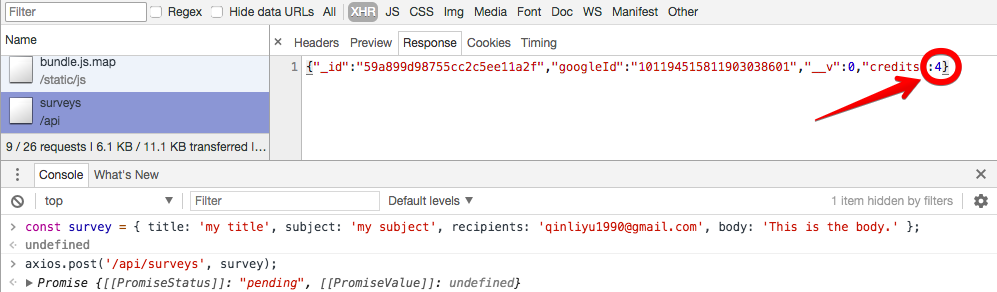

If you go to [mLab](https://mlab.com/home) and check the database, there is a new collection named `surveys` and the new record has been saved:

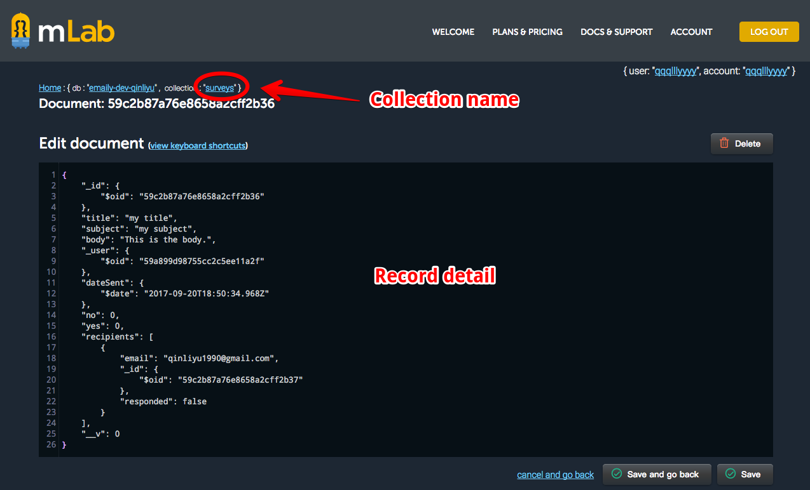

#### 4.9. Verifying SendGrid Click Tracking

Let's try to click the link in the email and test the click tracking. You can go to `Activity` section in SendGrid dashboard and view all the actions by the recipients:

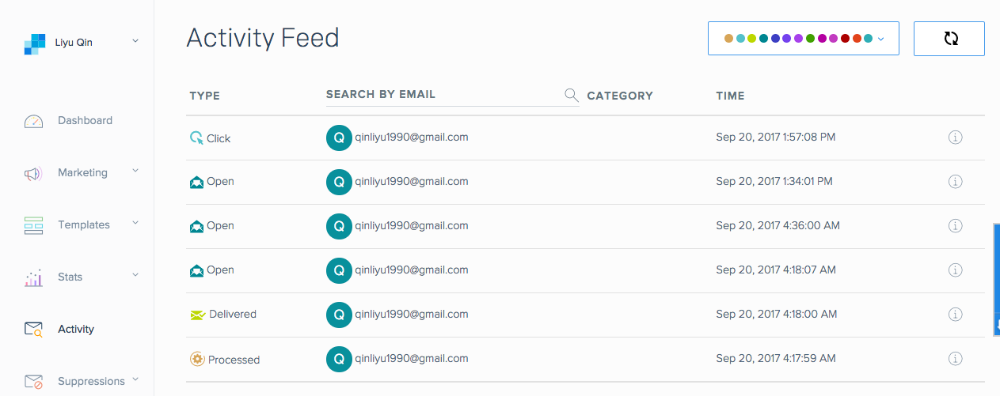

The last little task is to give some feedback after a user clicks the link. He should be directed to an appropriate domain. Let specify the domain that we want the user to be redirected to in `./config/`:

```javascript
// ./config/dev.js
//---------------------------------------------------------
module.exports = {
  ...
  redirectDomain: "http://localhost:3000"
};
//---------------------------------------------------------
// ./config/prod.js
//---------------------------------------------------------
// Don't forget to define 'REDIRECT_DOMAIN' in the Heroku dashboard
module.exports = {
  ...
  redirectDomain: process.env.REDIRECT_DOMAIN
};
```

Use the domain to update our template file and we want to take the user so some appropriate page after clicking. Let's create two route handlers first:

```javascript
// ./routes/surveyRoutes.js
//---------------------------------------------------------
module.exports = app => {
  // Custom page after voting
  app.get("/api/surveys/thanks", (res, req) => {
    res.send("Thanks for voting.");
  });
  ...
}
```

```javascript
// ./services/emailTemplates/surveyTemplate.js
//---------------------------------------------------------
const keys = require("../../config/keys");
module.exports = survey => {
  return `
    <html>
      <body>
        <div style="text-align:center;">
          <h3>I'd like your input.</h3>
          <p>Please answer the following question:</p>
          <p>${survey.body}</p>
          <div>
            <a href="${keys.redirectDomain}/api/surveys/thanks">Yes</a>
          </div>
          <div>
            <a href="${keys.redirectDomain}/api/surveys/thanks">No</a>
          </div>
        </div>
      </body>
    </html>
  `;
};
```

We have finished up with back-end survey-related tasks. In the next section, we'll move on the the client-side and make sure a user has the ability to create surveys.
