# Client Side Surveys - II

### Contents

1. [Form Validation](#user-content-1-form-validation)
    * [Validate Function](#user-content-11-validate-function)
    * [Showing Validation Errors](#user-content-12-showing-validation-errors)
    * [Generalizing Field Validation](#user-content-13-generalizing-field-validation)
    * [Toggling Visibility](#user-content-14-toggling-visibility)
2. [Form Review Page](#user-content-2-form-review-page)
    * [Retreat to the Form](#user-content-21-retreat-to-the-form)
    * [Persisting Form Values](#user-content-22-persisting-form-values)
    * [Refactoring Form Fields](#user-content-23-refactoring-form-fields)
3. [Submitting Form](#user-content-3-submitting-form)
    * [Submitting the Form in the Review Page](#user-content-31-submitting-the-form-in-the-review-page)
    * [Dumping Form Values](#user-content-32-dumping-form-values)
    * [Posting to Surveys](#user-content-33-posting-to-surveys)
    * [Redirect on Submit](#user-content-34-redirect-on-submit)

---

### 1. Form Validation

#### 1.1. Validate Function

When the user enters emails in the form, we should validate the emails as soon as possible. Let's dive in the validation in `redux-form`.

We can pass in another attribute when exporting the `SurveyForm` component, which is `validate`. It will run whenever the form is submitted. If the returned value from the `validate` function is an empty object, `redux-form` assumes the entire form is valid.

```javascript
// ./client/src/components/surveys/SurveyForm.js
//---------------------------------------------------------
/**
 * Validation Function
 * @param values: contains all the values from the form
 **/
function validate(values) {
  // We return an error object.
  // If the returned object is empty, 'redux-form' assumes that the entire form is valid.
  const errors = {};
  // If no title is provided
  if (!values.title) {
    errors.title = "You must provide a title.";
  }
  return errors;
}
// It takes only one argument object with the configurations how we want the form to behave.
export default reduxForm({
  validate,
  form: "surveyForm"
})(SurveyForm);
```

#### 1.2. Showing Validation Errors

The complicated part here is how to show the error to the user. When we returned the error object from the validation function, `redux-form` will look into the object. If any property name of the object matches up with the fields rendered. It will automatically take the error and pass it as a prop to our custom `Field` component.

To use that prop, pass another argument `meta` into our `SurveyField` component:

```javascript
// ./client/src/components/surveys/SurveyField.js
//---------------------------------------------------------
export default ({ input, label, meta }) => {
  console.log(meta);
  ...
};
```

We can the access the error message as `meta.error`:

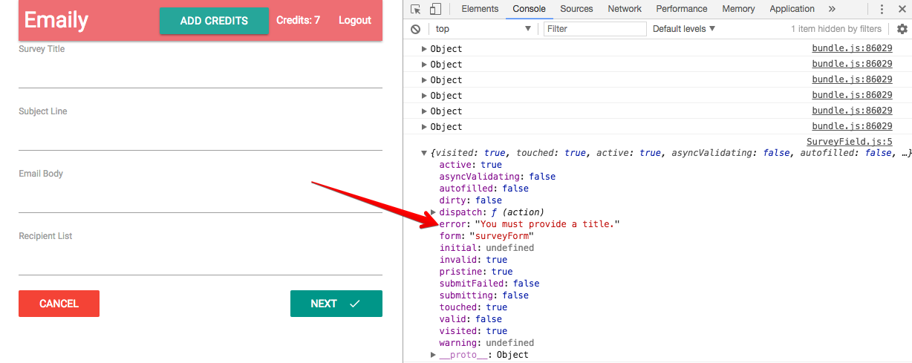

Thus we can show the error message until the user touches the input:

```javascript
// ./client/src/components/surveys/SurveyField.js
//---------------------------------------------------------
// 2-level destruction
export default ({ input, label, meta: { error, touched } }) => {
  console.log(meta);
  return (
    <div>
      <label>{label}</label>
      <input {...input} style={{ marginBottom: "5px" }} />
      <div className="red-text" style={{ marginBottom: "20px" }}>
        {touched && error} // If 'touched' is true, print the error
      </div>
    </div>
  );
};
```

We can then see the error message after clicked the input:

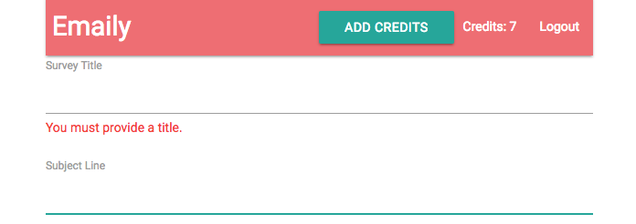

#### 1.3. Generalizing Field Validation

We now have the error message. The validation logic is the same for the first 3 fields, but we need a list of valid emails for the last one `recipients`.

```javascript
// ./client/src/components/surveys/SurveyForm.js
//---------------------------------------------------------
function validate(values) {
  const errors = {};
  // If no content is provided
  _.each(FIELDS, ({ name }) => {
    if (!values[name]) {
      errors[name] = `You must provide a ${name}.`;
    }
  });
  return errors;
}
```

To validate email, let's make a new function which is visible to the entire application since we may want to reuse it: `./client/src/utils/validateEmails.js`. Here is the workflow:

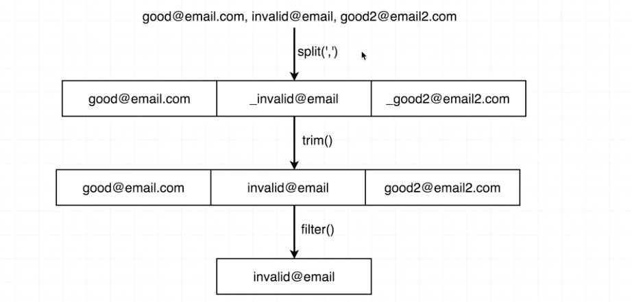

Email validation regular expression for different languages can be viewed in [Email Regex](http://emailregex.com/).

```javascript
// ./client/src/utils/validateEmails.js
//---------------------------------------------------------
// Regular expression to validate email.
const re = /^(([^<>()\[\]\\.,;:\s@"]+(\.[^<>()\[\]\\.,;:\s@"]+)*)|(".+"))@((\[[0-9]{1,3}\.[0-9]{1,3}\.[0-9]{1,3}\.[0-9]{1,3}])|(([a-zA-Z\-0-9]+\.)+[a-zA-Z]{2,}))$/
1
/^(([^<>()\[\]\\.,;:\s@"]+(\.[^<>()\[\]\\.,;:\s@"]+)*)|(".+"))@((\[[0-9]{1,3}\.[0-9]{1,3}\.[0-9]{1,3}\.[0-9]{1,3}])|(([a-zA-Z\-0-9]+\.)+[a-zA-Z]{2,}))$/;

// Export a function to validate emails
// It takes a string of emails and return a list of emails
export default emails => {
  const invalidEmails = emails
    .split(",")
    .map(email => email.trim())
    // If it's valid, return false, if it's invalid, return true
    // So that we can keep invalid emails.
    .filter(email => !re.test(email));
  if (invalidEmails.length) {
    return `These emails are invalid: ${invalidEmails}`;
  }
};
```

Then import the validate function for emails:


```javascript
// ./client/src/components/surveys/SurveyForm.js
//---------------------------------------------------------
import validateEmails from "../../utils/validateEmails";
function validate(values) {
  const errors = {};
  // Check emails
  // Provide an empty string if no email is entered.
  errors.emails = validateEmails(values.emails || '');
  // Check empty input
  _.each(FIELDS, ({ name }) => {
    if (!values[name]) {
      errors[name] = `You must provide a ${name}.`;
    }
  });
  return errors;
}
```

#### 1.4. Toggling Visibility

Now we have the validation function to validate user's input. We want `SurveyFormReview` to show after the user submits the form.

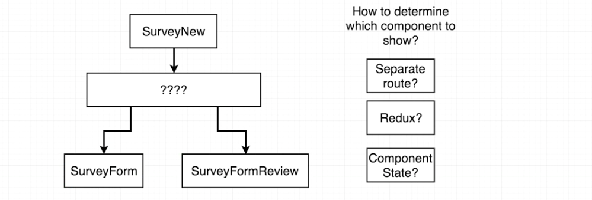

We have 3 options to do that, let's talk about pros and cons:

1. Add another route to `redux-router` for example `/surveys/new/review`.
  * Downside: We need extra code to make sure nothing goes wrong if the user copys the url and enter the review page directly.
2. Have some flag in our redux store to determine the status.
  * This is a valid solution, but we need extra action creator, reducer to do that.
3. Add a component-level state to the component `SurveyNew`.
  * This is the option we'll choose. We don't need to much code this way.

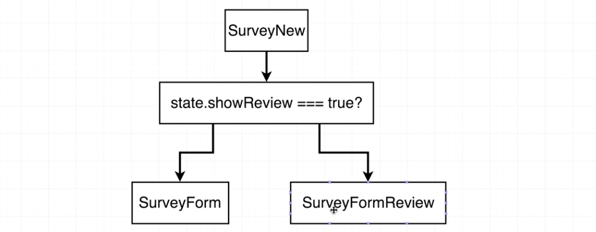

Let's create our review component first:

```javascript
// ./client/src/components/surveys/SurveyFormReview.js
//---------------------------------------------------------
import React from "react";
const SurveyFormReview = () => {
  return (
    <div>
      <h5>Please confirm your entries</h5>
    </div>
  );
};
export default SurveyFormReview;
```

Import the review component to the top-level component for survey (`SurveyNew`) and create a component-level state as the flag to toggle visibility.

Note that we added a prop (`onSurveySubmit`) for `SurveyForm` to flip the flag.

```javascript
// ./client/src/components/surveys/SurveyNew.js
//---------------------------------------------------------
import SurveyFormReview from "./SurveyFormReview";
class SurveyNew extends Component {
  // Component-level state as a flag to toggle visibility
  // This line is equivalent to:
  /*
    constructor(props) {
      super(props);
      this.state = { showFormReview: false };
    }
  */
  state = { showFormReview: false };

  // Helper function to render content
  renderContent() {
    if (this.state.showFormReview) {
      return <SurveyFormReview />;
    }
    return (
      <SurveyForm
        onSurveySubmit={() => this.setState({ showFormReview: true })}
      />
    );
  }

  render() {
    return <div>{this.renderContent()}</div>;
  }
}
```

Remember to use the prop `onSurveySubmit` as a callback function in `SurveyForm`:
```javascript
// ./client/src/components/surveys/SurveyForm.js
//---------------------------------------------------------
class SurveyForm extends Component {
  renderFields() { ... }
  render() {
    return (
      <div>
        <form onSubmit={this.props.handleSubmit(this.props.onSurveySubmit)}>
          ...
        </form>
      </div>
    );
  }
}
```

---

### 2. Form Review Page

#### 2.1. Retreat to the Form

We can test in the browser and the `SurveyFormReview` will be rendered after we submitted the form. Let's move on the review component. Users could click a `Cancel` button to go back to the previous form.

First we need a prop `onCancel` passed to `SurveyFormReview` to flip the flag:

```javascript
// ./client/src/components/surveys/SurveyNew.js
//---------------------------------------------------------
class SurveyNew extends Component {
  state = { showFormReview: false };
  renderContent() {
    if (this.state.showFormReview) {
      return (
        <SurveyFormReview
          onCancel={() => this.setState({ showFormReview: false })}
        />
      );
    }
    return (...);
  }
  render() {...}
}
```

Now let's update `SurveyFormReview`:

```javascript
// ./client/src/components/surveys/SurveyFormReview.js
//---------------------------------------------------------
// Deconstruct the 'props.onCancel' as 'onCancel'
const SurveyFormReview = ({ onCancel }) => {
  return (
    <div>
      <h5>Please confirm your entries</h5>
      <button className="yellow darken-3 btn-flat" onClick={onCancel}>
        Back
      </button>
    </div>
  );
};
```

#### 2.2. Persisting Form Values

All the input get cleared out if we click `Back` button in the review page. How can we persist the data when we come back to it?

Remember we use the `reduxForm` when exporting `SurveyForm`. There is another property named `destroyOnUnmount`. It is true by default, which means all the data will be cleared if the component is unmounted (no longer shown on the screen).

```javascript
// ./client/src/components/surveys/SurveyForm.js
//---------------------------------------------------------
...
export default reduxForm({
  validate,
  form: "surveyForm",
  destroyOnUnmount: false
})(SurveyForm);
```

Next we need to show all the values in `SurveyFormReview`, how can we get access to the input values in the review page?

We use `redux` to hold all the value. We still need the `connect` helper from `react-redux`.

```javascript
// ./client/src/components/surveys/SurveyFormReview.js
//---------------------------------------------------------
import { connect } from "react-recux";
// Take our redux state and transform them into some props,
// then send down to the component.
function mapStateToProps(state) {
  console.log(state);
  // Pass 'formValues' as a prop into our component
  return { formValues: state.form.surveyForm.values };
}
export default connect()(SurveyFormReview);
```

The application state that has been printed out can be viewed in the browser console:


#### 2.3. Refactoring Form Fields

Let's then extract `formValues` which is just created when generating the functional component `SurveyFormReview`.

To avoid duplication, we want to extract `FIELDS` defined in `SurveyForm`:

```javascript
// ./client/src/components/surveys/formFields.js
//---------------------------------------------------------
export default [
  { label: "Survey Title", name: "title" },
  { label: "Subject Line", name: "subject" },
  { label: "Email Body", name: "body" },
  { label: "Recipient List", name: "emails" }
];
//---------------------------------------------------------
// ./client/src/components/surveys/SurveyForm.js
//---------------------------------------------------------
import formFields from "./formFields";
// Replace `FIELDS` by `formFields` for the entire file
```

Let's then finalize the review fields:

```javascript
// ./client/src/components/surveys/SurveyFormReview.js
//---------------------------------------------------------
import _ from "lodash";
import formFields from "./formFields";
const SurveyFormReview = ({ onCancel, formValues }) => {
  // All the fields to be rendered
  const reviewFields = _.map(formFields, ({ name, label }) => {
    return (
      <div key={name}>
        <label>{label}</label>
        <div>{formValues[name]}</div>
      </div>
    );
  });

  return (
    <div>
      <h5>Please confirm your entries</h5>
      {reviewFields}
      <button className="yellow darken-3 btn-flat" onClick={onCancel}>
        Back
      </button>
    </div>
  );
};
```

All the fields are now displayed well in the review page:

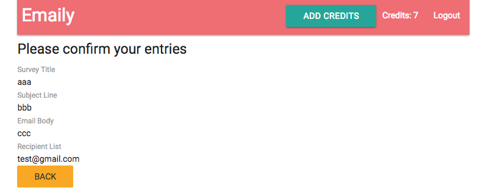

---

### 3. Submitting Form

#### 3.1. Submitting the Form in the Review Page

Let's add a button to submit the form in the review page.

```javascript
// ./client/src/components/surveys/SurveyFormReview.js
//---------------------------------------------------------
...
<button className="green btn-flat right white-text">
  Send Survey
  <i className="material-icons right">email</i>
</button>
...
```

The application should 'do something' when a user clicks the button.

Remeber whenever we're talking about 'do something' in our react app, we're always talking about `action creators`. Let's then create an action cretor `submitSurvey`:

```javascript
// ./client/src/actions/index.js
//---------------------------------------------------------
// Submit the form
export const submitSurvey = values => {
  return { type: "submit_survey" }; // Just leave it like this and we'll update it soon.
};
```

Then import the action creator and hook it up with our `SurveyFormReview` component:

```javascript
// ./client/src/components/surveys/SurveyFormReview.js
//---------------------------------------------------------
import * as actions from "../../actions";
// 'submitSurvey' is now a prop
const SurveyFormReview = ({ onCancel, formValues, submitSurvey }) => {
  ...
  return (
    ...
      <button
        onClick={() => submitSurvey(formValues)}
        className="green btn-flat right white-text"
      >
    ...
  );
};
export default connect(mapStateToProps, actions)(SurveyFormReview);
```

Before finishing up with the form submission, we still have some issues to fix.

#### 3.2. Dumping Form Values

Note that if a user clicks `Cancel` button in the form page, he will be redirected to the dashboard. But if he wants to create a new survey and enter the form page again, all the form data will be persisted beacuse of the `destroyOnUnmount` property we set in `SurveyForm` component. This is not what we want.

We want the form data to be cleared whenever the user goes back to the dashboard. Here is the code we use, we'll explain it later:

```javascript
// ./client/src/components/surveys/SurveyNew.js
//---------------------------------------------------------
import { reduxForm } from "redux-form";
...
// Use 'reduxForm' helper to clean form data when a user left the page.
export default reduxForm({
  form: "surveyForm"
})(SurveyNew);
```

We initially wired up our `reduxForm` helper in the component `SurveyForm`: If it is unmounted, do not destroy the values. We then wired it up with `SurveyNew` component. This time we did not use `destroyOnUnmount`. So when the container component `SurveyNew` is unmounted, the data will be cleared.

That is the default behavior of `redux-form`.

Before posting the object to the back-end, we noticed that we have mis-matched property names between front-end and back-end (`./routes/surveyRoutes.js`). We need to replace `emails` by `recipients` in the front-end.

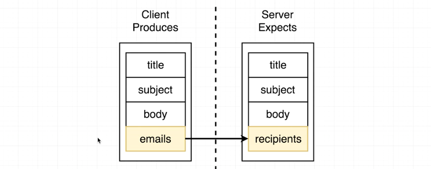

Only two places need to be modified:

```javascript
// ./client/src/components/surveys/formFields.js
//---------------------------------------------------------
export default [
  ...
  { label: "Recipient List", name: "recipients" }
];
//---------------------------------------------------------
// ./client/src/components/surveys/SurveyForm.js
//---------------------------------------------------------
...
function validate(values) {
  ...
  // Provide an empty string if no email is entered.
  errors.recipients = validateEmails(values.recipients || "");
  ...
}
...
```

#### 3.3. Posting to Surveys

We are approaching the end of the feature:

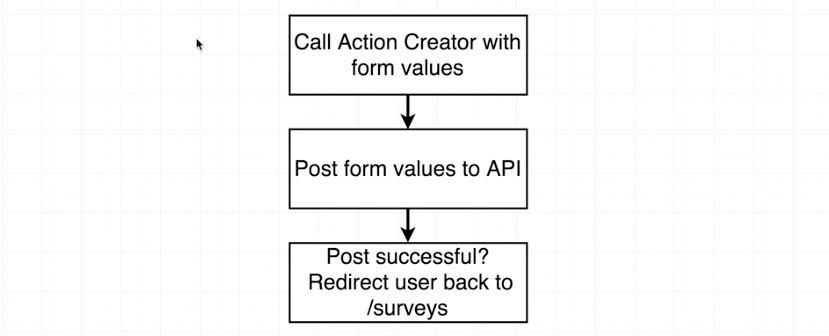

Note that we send back the user model for api `/api/surveys`, which is defined in `./routes/surveyRoutes.js`. So we should also dispatch the type `FETCH_USER` to update the user model in our application state.

```javascript
// ./client/src/actions/index.js
//---------------------------------------------------------
// Submit the form
// Take the form values and make a post request to the back-end
export const submitSurvey = values => async dispatch => {
  // The API returns the updated user model,
  // which is defined in `./routes/surveyRoutes`
  const res = await axios.post("/api/surveys", values);
  // So we should also dispatch the type `FETCH_USER`
  // to update the user model in our application state.
  dispatch({ type: FETCH_USER, payload: res.data });
};
```

We can then test our application and an email will be received.

#### 3.4. Redirect on Submit

We want the user to be redirected to the dashboard after submitting the form. This is not as easy as you may assume. Here is why:

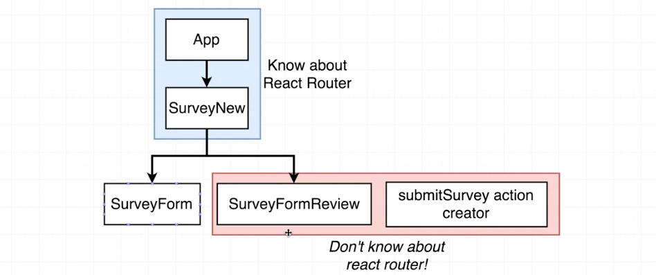

`App` and `SurveyNew` know the `react-router`, when I say 'know', I mean these components contain some logic that directly refer to `react-router`.

Inorder to let the action creator `submitSurvey` has some logic to navigate, we'll teach `SurveyFormReview` about `react-router`, then `SurveyFormReview` can pass it to the action creator:

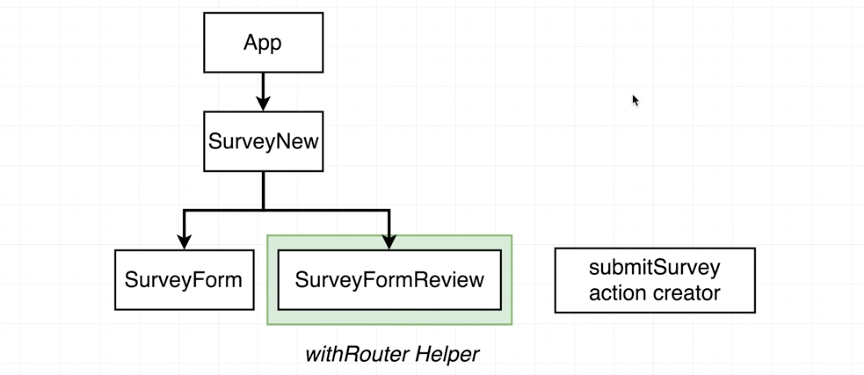

We'll use the helper `withRouter`, it can teach some component about our router so that they can navigate around in the application: [withRouter Documentation](https://reacttraining.com/react-router/web/api/withRouter)

We can use the `withRouter` to get access to the variable called `history`, then use it to navigate arount.

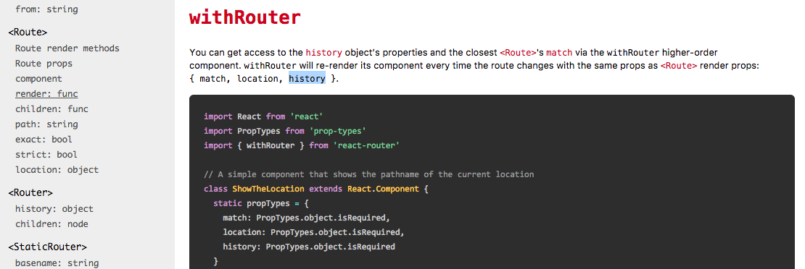

```javascript
// ./client/src/components/surveys/SurveyFormReview.js
//---------------------------------------------------------
import { withRouter } from "react-router-dom";
// 'history' is created by the helper 'withRouter'
const SurveyFormReview = ({ onCancel, formValues, submitSurvey, history }) => {
  const reviewFields = ...;
  return (
    ...
      <button
        onClick={() => submitSurvey(formValues, history)}
        className="green btn-flat right white-text"
      >
    ...
  );
};
export default connect(mapStateToProps, actions)(withRouter(SurveyFormReview));
```

The `history` object is passed into the component on the prop's object. Now we can access `history` in our action creator:

```javascript
// ./client/src/actions/index.js
//---------------------------------------------------------
export const submitSurvey = (values, history) => async dispatch => {
  ...
  // Navigate to another component using `history` by `withRouter`
  history.push("/surveys");
  ...
};
```
