# Handling Webhook Data

### Contents

1. [Feedback with Webhooks](#user-content-1-feedback-with-webhooks)
    * [Webhooks in Development](#user-content-11-webhooks-in-development)
    * [LocalTunnel Setup](#user-content-12-localtunnel-setup)
    * [SendGrid Setup and Testing Webhooks](#user-content-13-sendgrid-setup-and-testing-webhooks)
    * [Encoding Survey Data](#user-content-14-encoding-survey-data)
    * [Processing Pipeline](#user-content-15-processing-pipeline)
2. [Server Side Setup for Survey Results](#user-content-2-server-side-setup-for-survey-results)
    * [Parsing the Route](#user-content-21-parsing-the-route)
    * [Lodash Chain Helper](#user-content-22-lodash-chain-helper)
    * [Checking Status and Updating Records](#user-content-23-checking-status-and-updating-records)

---

### 1. Feedback with Webhooks

#### 1.1. Webhooks in Development

Webhooks means a server make requests to another server beacuse of some event.

We now have a front-end form to send the survey and a back-end handler to accept the survey and send email. There are only two remaining features:

* Show a list of surveys in the dashboard.
* Update the database if a user clicks links in the email.

Remember the click event can be tracked by SendGrid, this time we want SendGrid to send a message to us and tell us who clicks the links.

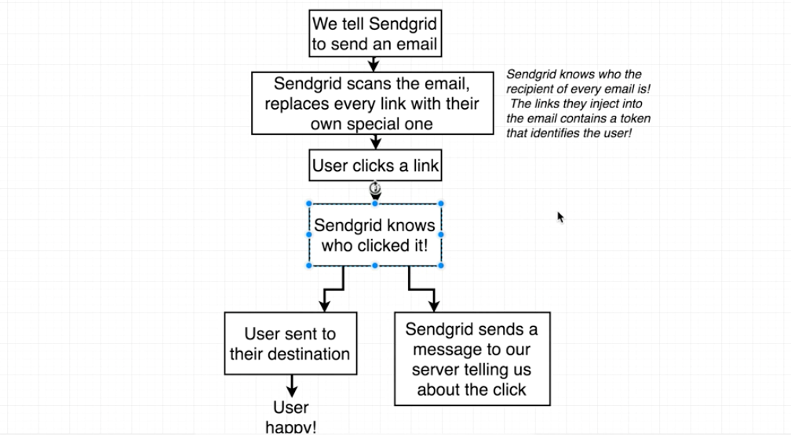

Here is the process. SendGrid will not send us a message once a user clicks a link, it will wait for 30 sec or 1 minute and then send us the data.

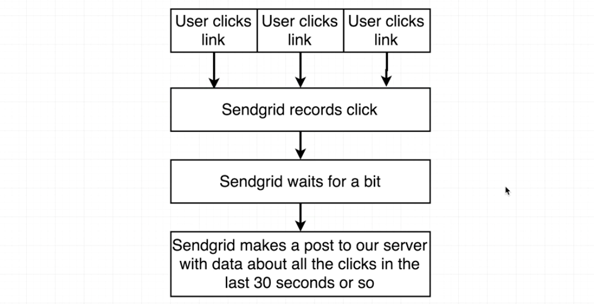

We'll first talk about how webhooks work in production because that is a easier case, and then talk about how things break down in the dev enrivonment.

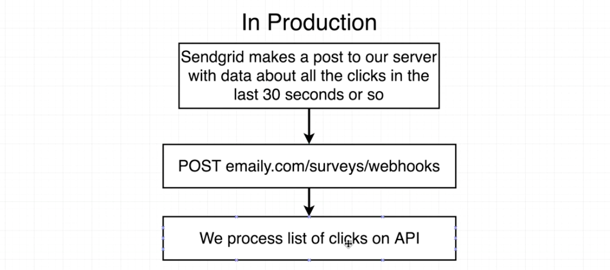

Note that in production, SendGrid has no difficulty making a post request to our domain since it's visible to the outside world.

But for development, SendGrid can not make request to `localhost`.

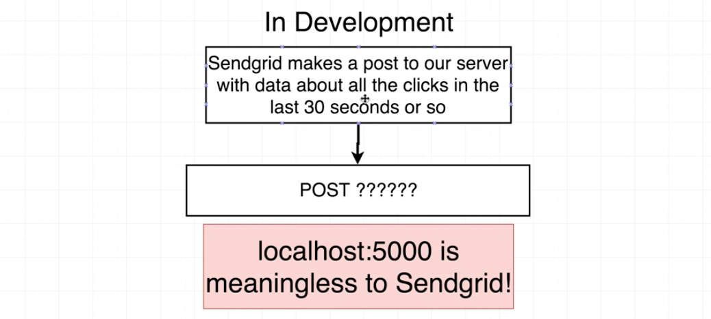

[LocalTunnel](https://localtunnel.github.io/www/) is needed to solve the problem:

We can tell SendGrid to make requests to some domain by LocalTunnel, which is a service for handling webhooks for development. The request will be forwarded to a LocalTunnel server that is running on our computer. The local server can then forward the request to `localhost`.

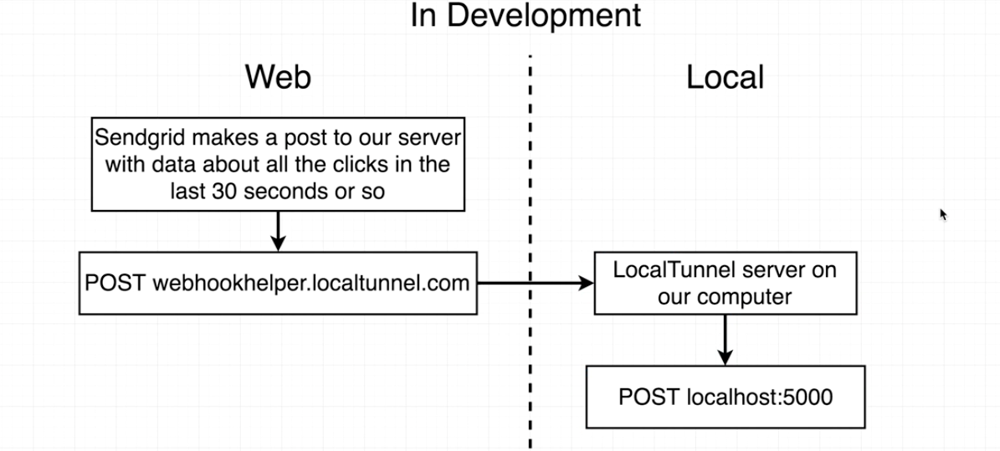

#### 1.2. LocalTunnel Setup

Install `LocalTunnel` first:

```
npm install --save localtunnel
```

The create a start script to run localtunnel anytime we start the server. We need to define the port and a subdomain to receive requests:

```javascript
// ./package.json
//---------------------------------------------------------
"scripts": {
  ...
  "dev":
    "concurrently \"npm run server\" \"npm run client\" \"npm run webhook\"",
  ...
  "webhook": "lt -p 5000 -s anytextassubdomainforliyu"
},
```

We can get the following info when running our dev server again. Not that any request coming in to this url will be auto forwarded to our local machine.

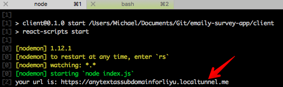

#### 1.3. SendGrid Setup and Testing Webhooks

Let's create a route handler to receive SendGrid notification and then go to SendGrid to setup the event notification:

```javascript
// ./routes/surveyRoutes.js
//---------------------------------------------------------
module.exports = app => {
  ...
  // SendGrid notification
  app.post("/api/surveys/webhooks", (req, res) => {
    console.log(req.body);
    res.send({});
  });
  ...
}
```

Then go to SendGrid dashboard: **Settings -> Mail Settings -> Event Notification**

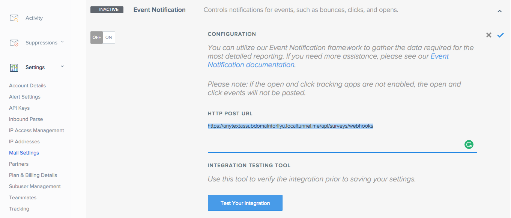

After clicking the test button, it seems that the `localtunnel` script appears to be crashing very often. So we use a tiny script to start `localtunnel`:

```bash
# ./sendgrid_webhook.sh
#---------------------------------------------------------
function localtunnel {
  lt -s anytextassubdomainforliyu --port 5000
}
until localtunnel; do
echo "localtunnel server crashed"
sleep 2
done
```

Don't forget to give the script execution permissions:
```
chmod +x sendgrid_webhook.sh
```

Then in the ./package.json file, use the script to run `localtunnel`:

```javascript
// ./package.json
//---------------------------------------------------------
"scripts": {
  ...
  "dev":
    "concurrently \"npm run server\" \"npm run client\" \"npm run webhook\"",
  ...
  "webhook": "./sendgrid_webhook.sh"
},
```

Now if we click the blue test button in the SendGrid console, we can have `req.body` printed in the terminal:

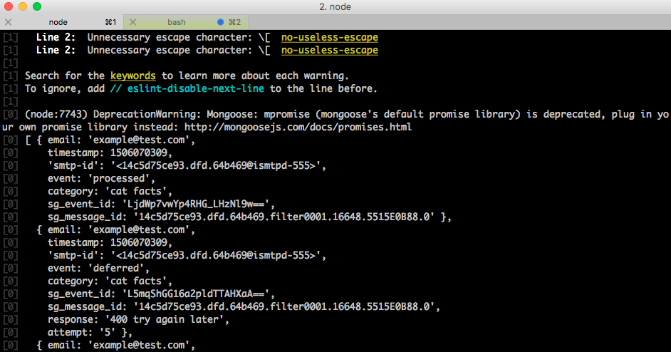

In the webhook body, we have an array of different objects. Each object has an event property of the following:

* click: when a user clicks the link (this is what we want)
* bounce: email failed to send
* spamreport
* unsubscribe
* group_resubscribe

A demo object with `click` event looks like this:

```javascript
{
  email: 'example@test.com',
  timestamp: 1506070309,
  'smtp-id': '<14c5d75ce93.dfd.64b469@ismtpd-555>',
  event: 'click',
  category: 'cat facts',
  sg_event_id: 'O6aEFwXUQKbouNER11_WOQ==',
  sg_message_id: '14c5d75ce93.dfd.64b469.filter0001.16648.5515E0B88.0',
  useragent: 'Mozilla/4.0 (compatible; MSIE 6.1; Windows XP; .NET CLR 1.1.4322; .NET CLR 2.0.50727)',
  ip: '255.255.255.255',
  url: 'http://www.sendgrid.com/'
},
```

Let's select actions in SendGrid console and finish the setup:

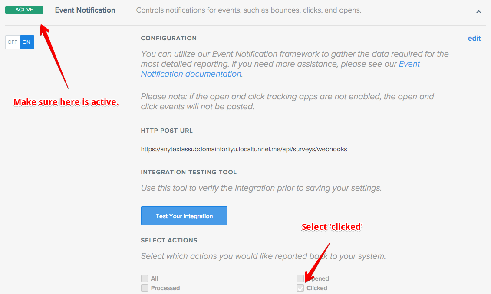

We can not setup SendGrid notifications for both production and development. So we need to go back to SendGrid console and update the url before deployment.

Let's test it: send an email using our app and click the link in the email we received. The notification will appear in the terminal after a while:

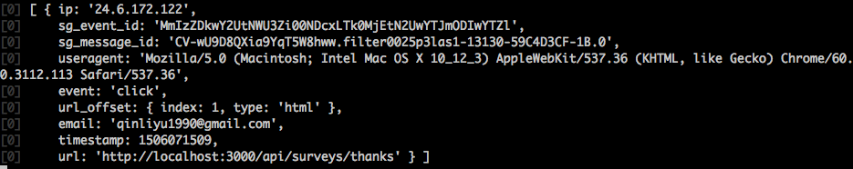

#### 1.4. Encoding Survey Data

Note that no information about the survey is in the notification, we can not know whether the user clicks 'yes' or 'no'. The only thing we get is the user's email. We need to figure out which survey the email belongs to and the user's choice.


Here is our solution:

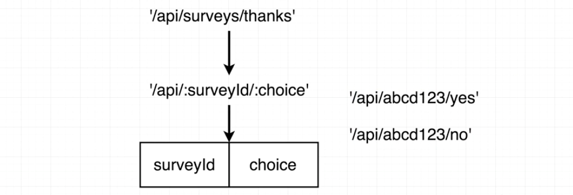

So we need to update the links in the email template:

```javascript
// ./services/emailTemplates/surveyTemplate.js
//---------------------------------------------------------
`...
  <div>
    <a href="${keys.redirectDomain}/api/surveys/${survey.id}/yes">Yes</a>
  </div>
  <div>
    <a href="${keys.redirectDomain}/api/surveys/${survey.id}/no">No</a>
  </div>
...`
```

Now if we test our app and click the link in the email, we can get the url with both survey id and the option in the `url` field:

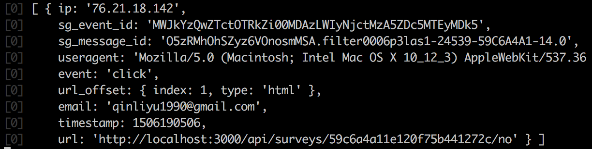

One more thing to consider: the user may click the link multiple times and we'll receive duplicate click records from SendGrid, we need to get rid of it. We also need to make sure we use records with `click` event only. That's why data pre-processing is necessary.

#### 1.5. Processing Pipeline

Here is what we may get from the SendGrid webhook:

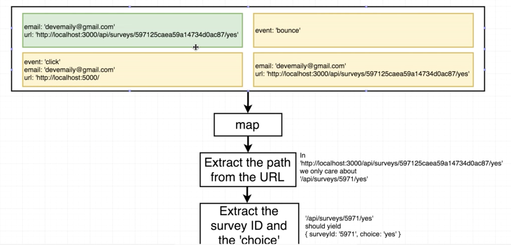

Only the first record should be filtered. The second one is not a `click` event, the third one is not a link to appropriate page, and the fourth one is identical to the first one.

Whenever we receive a list of records, run a `map` function for filtering. Fist we look at its `url` property. If the event has a url, just extract the right portion (e.g. `/api/surveys/1234/yes`) and we don't care about its domain. Then extract its surveyId and the choice: `{ surveyId: '1234', choice: 'yes' }`.

After the fist map function, the 2nd & 3rd records will be `undefined`:


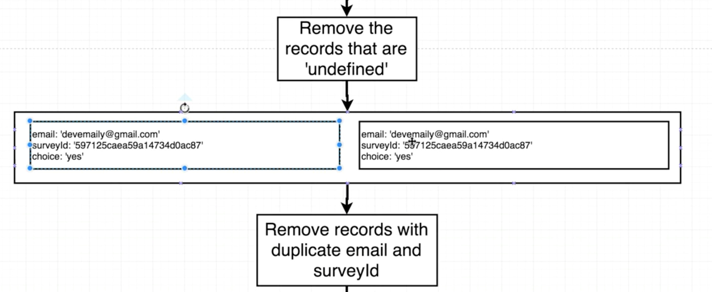


---

### 2. Server Side Setup for Survey Results

#### 2.1. Parsing the Route

We're now going to install two modules to help us implement the pipeline mentioned in the last section:

```
npm install --save lodash path-parser
```

Then we need to do the processing logic in the route handler for `/api/surveys/webhooks`:

```javascript
// ./routes/surveyRoutes.js
//---------------------------------------------------------
const _ = require("lodash");
const Path = require("path-parser");
const { URL } = require("url"); // 'url' is a default module in nodejs system.
// SendGrid notification
app.post("/api/surveys/webhooks", (req, res) => {
  // 1. The extract process with map function
  // 'req.body' is the list of events
  const events = _.map(req.body, ({ email, url }) => {
    // Remove domain part
    const pathname = new URL(url).pathname;
    // Pull out just surveyId and choice
    const p = new Path("/api/surveys/:surveyId/:choice");
    // 'p.test(pathname)' will return an object with two properties `surveyId` and `choice`.
    // If `pathname` doesn't have surveyId or choice, `match` will be null;
    const match = p.test(pathname);
    if (match) {
      return {
        email,
        surveyId: match.surveyId,
        choice: match.choice
      };
    }
  });
  // Remove 'undefined' element from an array
  const compactEvents = _.compact(events);
  // Remove duplications with same 'email' and 'surveyId'
  const uniqueEvents = _.uniqBy(compactEvents, "email", "surveyId");
  console.log(uniqueEvents);
});
```

#### 2.2. Lodash Chain Helper

We now have the logic in our route handler, we can condense it down.

Note that we used 3 lodash helpers in the logic: `map`, `compact` and `uniqBy`. We can use the chain function to reduce the code. We can chain on as many lodash helpers as we want and get rid of the temporary variables:

```javascript
const arr = [1,3,2];
_.chain(arr)            // [1,3,2]
  .map(num => num * 2)  // [2,6，4]
  .map(num => num / 10) // [0.2, 0.6, 0.4]
  .map(num => num + 'hi there') // ["0.2hi there", "0.6hi there", "0.4hi there"]
  .sort() // ["0.2hi there", "0.4hi there", "0.6hi there"]
  .value(); // Returns the newly processed array
```

So we can chain those 3 lodash helpers:

```javascript
// ./routes/surveyRoutes.js
//---------------------------------------------------------
// SendGrid notification
app.post("/api/surveys/webhooks", (req, res) => {
  const p = new Path("/api/surveys/:surveyId/:choice");
  const events = _.chain(req.body)
    .map(({ email, url }) => {
      const match = p.test(new URL(url).pathname);
      if (match) {
        return {
          email,
          surveyId: match.surveyId,
          choice: match.choice
        };
      }
    })
    .compact()
    .uniqBy("email", "surveyId")
    .value();
});
```

#### 2.3. Checking Status and Updating Records

Now we have the email and the surveyId. The next step is to check the database to see whether the email has voted this survey before.

Let's look at a BAD query example and figure out why it's bad:

```javascript
_.forEach(events, ({ surveyId, email, choice }) => {
  // Find the record with some 'surveyId'
  // BAD: because it returns the 'survey' will all sub-document of recipients to our Express server.
  // There might be thousands of recipients and we should not return all of them.
  let survey = await Survey.findById(surveyId);
  // Find a recipient that matches the email and has not responded yet
  const responder = survey.recipients.find(recipient =>
    recipient.email === email && !recipient.responded
  );
  if (!responder) {
    // The recipient has already responded
    return console.warn('Response already logged!');
  } else {
    // Set the responded flag to true
    survey.recipients.id(responder.id).responded = true;
    survey[answer] += 1;
    survey.lastResponded = new Date(timestamp * 1000);
    // BAD: We're sending back not only the survey, but all the recipients to the database.
    survey.save();
  }
});
```

We want to minimize the amount of data we're trying to pull out of the database. We should combine the logic in db queries and just pull out the right recipient. So we may need a complex query.

```javascript
// Find the record with the first argument as the criteria,
// and then update the record with the second argument.
// We don't need to pull the survey out to our Express server, just need to update it.
const email = 'test@gmail.com';
const choice = 'yes'; // (or 'no')
Survey.updateOne({
  _id: surveyId, // Find the right survey first
  recipients: { // Look into its `recipients` sub-collection
    // Find one element that matches the given criteria
    $elemMatch: { email: email, responded: false }
  }
}, {
  // '$inc' is a mongo operator, it allows us to put some logic inside the query.
  // '[]' here doesn't means an array, it will be translated to 'yes' or 'no'
  $inc: { [choice]: 1 }, // Increase choice ('yes' or 'no') by 1
  // Look at the `recipients` subdoc collection of the survey we just found.
  // '$' means to update just the recipient found by '$elemMatch' operator in the first argument.
  $set: { 'recipients.$.responded': true }
});
```

Now let's take the query to our route handler, but where should we put the query? Remember we need to do an `update` query for each event we received. So we can just add one more step in the lodash chain and run the query:

```javascript
// ./routes/surveyRoutes.js
//---------------------------------------------------------
const mongoose = require("mongoose");
// Access database
const Survey = mongoose.model("surveys");
app.post("/api/surveys/webhooks", (req, res) => {
  const p = new Path("/api/surveys/:surveyId/:choice");

  _.chain(req.body)
    .map(...)
    .compact()
    .uniqBy(...)
    // Run query for every event in the 'events' array
    .each(({ surveyId, email, choice }) => {
      Survey.updateOne(
        {
          _id: surveyId, // Find the right survey first
          recipients: {
            // Look into its `recipients` sub-collection
            // Find one element that matches the given criteria
            $elemMatch: { email: email, responded: false }
          }
        },
        {
          // '$inc' is a mongo operator, it allows us to put some logic inside the query.
          // '[]' here doesn't means an array, it will be translated to 'yes' or 'no'
          $inc: { [choice]: 1 }, // Increase choice ('yes' or 'no') by 1
          // Look at the `recipients` subdoc collection of the survey we just found.
          // '$' means to update just the recipient found by '$elemMatch' operator in the first argument.
          $set: { "recipients.$.responded": true },
          lastResponded: new Date()
        }
      ).exec(); // Execute the query by calling 'exec()'
    })
    .value();
});
```

Note that the update query is an async call, why don't we use `async/await` keywords? The reason is that in the context of the webhook `/api/surveys/webhooks`, we don't have anything to respond back to SendGrid with.

We can then test our app and view the record in our database, everything works just fine:

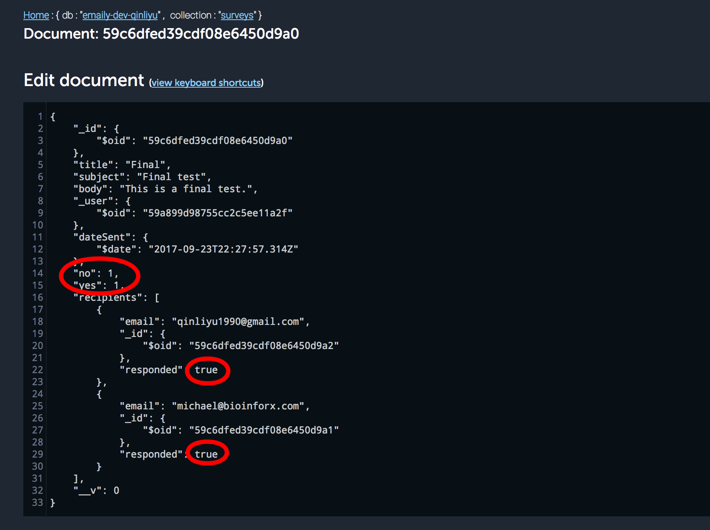

The last step is to create a router for the redirecting route `/api/surveys/:surveyId/choice`:

```javascript
// ./routes/surveyRoutes.js
//---------------------------------------------------------
// Custom page after voting
app.get("/api/surveys/:surveyId/:choice", (req, res) => {
  res.send("Thanks for voting.");
});
```
