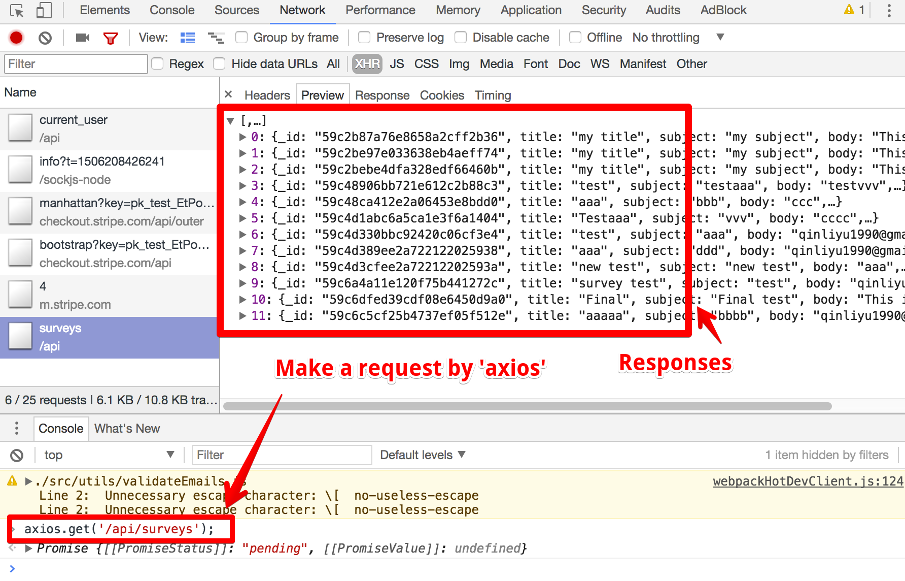

# The Home Stretch

### Contents

1. [Fetching a List of Surveys](#user-content-1-fetching-a-list-of-surveys)
2. [Displaying Surveys in the Front End](#user-content-2-displaying-surveys-in-the-front-end)
    * [Wiring Surveys Up to Redux](#user-content-21-wiring-surveys-up-to-redux)
    * [Wiring React to Redux](#user-content-22-wiring-react-to-redux)
    * [Rendering a List of Surveys](#user-content-23-rendering-a-list-of-surveys)

---

### 1. Fetching a List of Surveys

We're almost done with the application. The last part is to display the surveys in the homepage.

The first thing is to make a route handler to respond to any request made to `/api/surveys`.

```javascript
// ./routes/surveyRoutes.
//---------------------------------------------------------
// Don't forget to pass in the middleware 'reuqireLogin' to authenticate
// We just don't want the surveys with their big lists of recipients.
app.get("/api/surveys", reuqireLogin, async (req, res) => {
  // The current user is 'req.user'
  // Every survey model has a property '_user' which is the user id
  const surveys = await Survey.find({ _user: req.user.id });
  res.send(surveys);
});
```

However, we don't want mongoose to return surveys with their `recipients` collections since we don't need them in the homepage.

We can use `#select` to include or exclude document fields. Documentations here: [Query#select](http://mongoosejs.com/docs/api.html#query_Query-select)

```javascript
// ./routes/surveyRoutes.
//---------------------------------------------------------
app.get("/api/surveys", reuqireLogin, async (req, res) => {
  const surveys = await Survey.find({ _user: req.user.id })
    // Do not include 'recipients'
    .select({ recipients: false });
  res.send(surveys);
});
```

We can test it by making a request manually in the browser console:



---

### 2. Displaying Surveys in the Front End

#### 2.1. Wiring Surveys Up to Redux

To display surveys in the front-end, we need another action creator to make the request:

```javascript
// ./client/src/actions/types.js
//---------------------------------------------------------
export const FETCH_SURVEYS = "fetch_surveys";
//---------------------------------------------------------
// ./client/src/actions/index.js
//---------------------------------------------------------
import { FETCH_USER, FETCH_SURVEYS } from "./types";
// Fetch a list of surveys
export const fetchSurveys = () => async dispatch => {
  const res = await axios.get("/api/surveys");
  dispatch({ type: FETCH_SURVEYS, payload: res.data });
};
```

The create the reducer:

```javascript
// ./client/src/reducers/surveysReducer.js
//---------------------------------------------------------
import { FETCH_SURVEYS } from "../actions/types";
// Return an empty array by default
export default function(state = [], action) {
  switch (action.type) {
    case FETCH_SURVEYS:
      return action.payload;
    default:
      return state;
  }
}
//---------------------------------------------------------
// ./client/src/reducers/index.js
//---------------------------------------------------------
import surveysReducer from "./surveysReducer";
export default combineReducers({
  ...
  surveys: surveysReducer
});
```

#### 2.2. Wiring React to Redux

We want the `Dashboard` component to show the surveys. To make the logic clearer, we'll make a component `SurveyList` just to fetch and show the surveys, and import it into `Dashboard`.

```javascript
// ./client/src/components/surveys/SurveyList.js
//---------------------------------------------------------
import React, { Component } from "react";
import { connect } from "react-redux";
// Import the action creator
import { fetchSurveys } from "../../actions";

class SurveyList extends Component {
  componentDidMount() {
    this.props.fetchSurveys();
  }
  render() {
    return <div>SurveyList</div>;
  }
}

// Destructured `state`
function mapStateToProps({ surveys }) {
  return { surveys };
}
export default connect(mapStateToProps, { fetchSurveys })(SurveyList);

//---------------------------------------------------------
// ./client/src/components/Dashboard.js
//---------------------------------------------------------
import SurveyList from "./surveys/SurveyList";
const Dashboard = () => {
  return (
    <div>
      <SurveyList />
      ...
    </div>
  );
};
```

#### 2.3. Rendering a List of Surveys

We'd like to use [Card](http://materializecss.com/cards.html) of `Materialize CSS` to display the surveys:

```javascript
// ./client/src/components/surveys/SurveyList.js
//---------------------------------------------------------
class SurveyList extends Component {
  componentDidMount() {
    this.props.fetchSurveys();
  }
  // Helper method the render surveys
  renderSurveys() {
    // 'reverse()' will show the newest survey on the top
    return this.props.surveys.reverse().map(survey => {
      return (
        <div className="card darken-1" key={survey._id}>
          <div className="card-content">
            <span className="card-title">{survey.title}</span>
            <p>{survey.body}</p>
            <p className="right">
              Sent On: {new Date(survey.dateSent).toLocaleDateString()}
            </p>
          </div>
          <div className="card-action">
            <a>Yes: {survey.yes}</a>
            <a>No: {survey.no}</a>
          </div>
        </div>
      );
    });
  }
  // Main render method
  render() {
    return <div>{this.renderSurveys()}</div>;
  }
}
```

Now we have finished up with the main features of the application. Don't forget to change the SendGrid notification setting when deploying it. Change it from `https://anytextassubdomainforliyu.localtunnel.me/api/surveys/webhooks` to `https://vast-garden-42186.herokuapp.com/api/surveys/webhooks`. We can also create a new SendGrid account.
